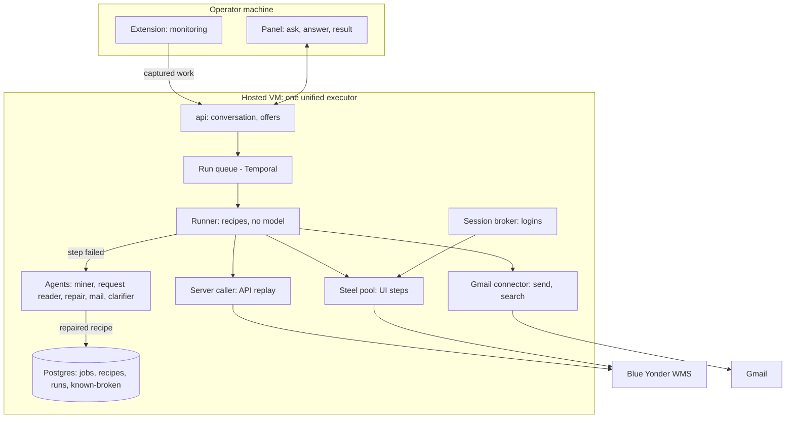

# VM execution, compiled recipes and prompted agents

Status: agreed direction, 2026-09-23. Nothing below is built yet unless marked **done**.

## 1. Decisions

| # | Decision | Decided by |
| --- | --- | --- |
| D1 | No task runs in the operator's Chrome. Every UI action, API call and tool call runs on our VM: a Steel browser, a server-side caller, or a connector tool. | Management, confirmed by the operator lead |
| D2 | The extension does two things only: **monitoring** (capturing the operator's own work, for learning) and **the panel** (asking, answering, showing results). | Operator lead |
| D3 | **Full autonomy from the first run.** Once a job is learned, a request runs it end to end with no approval, writes included. The three-verified-runs gate goes away. | Operator lead |
| D4 | The panel asks only when a person is really needed: a missing required value, an unsure job match, a missing password or MFA, or a run stuck after automatic repair. | Operator lead |
| D5 | Allowlists belong to the extension (which hosts it watches) and the panel. There is no mail-sender allowlist; the VM is one unified executor. Mail and page text are **untrusted data** to every agent, and that is enforced in the prompts. | Operator lead |
| D6 | Jobs are compiled into **recipes** and run **without a model or a screenshot**. A model is called only when a recipe step fails, and the fix is written back so the same failure is not repeated. | Operator lead |
| D7 | Agents and their prompts are first-class: each prompt is versioned, and is measured on real cases before it ships. | Operator lead |

## 2. Why: measured latency

A step is slow because of model calls, not because of the browser.

| Measure | Value | Source |
| --- | --- | --- |
| Verified run, QA box | median 71 s, 5.1 steps, ~15 s per step (44 runs) | `workflow_runs`, QA Postgres, 2026-09-23 |
| Verified run, local | median 24 s, 2.6 steps, ~10 s per step (36 runs) | local Postgres |
| Browser action in self-hosted Steel (goto, fill, select, click, screenshot) | 9–65 ms median; connecting over CDP 630 ms | Playwright over CDP to `ai-sro-steel-1` |
| Planning call, gemini-3.8-flash with screenshot | median 3.2 s (2.2–11.2 s), ~$0.002 | 4 calls, real `PLAN_INSTRUCTIONS` |
| Planning call, gemini-3.1-pro-preview | median 3.5 s, ~$0.005 | 4 calls |
| How QA steps were confirmed | 146 by a screen model call, 17 by status code, 61 by read-back; only 33 of 596 steps were API calls | `workflow_run_steps` |

A typical step makes two model calls: one to plan it and one to judge a screenshot. The browser action inside the step is under 1% of its time.

**Target:** a 5-step job goes from about 71 s to 15–20 s (estimate), and most steps take under 0.5 s. Each phase in §10 reports measured before/after numbers.

## 3. Target architecture



- **The extension** captures gestures and calls from the operator's own work, as it does today, and hosts the panel. It never executes a run step.
- **The runner** executes a job's recipe. It picks the medium for each step, in this order: connector tool, proven API call, UI in Steel.
- **The agents** are the only places a model is used: learning, reading requests, repairing, handling mail, wording questions.
- **The session broker** signs in to each system per account, keeps the session alive, and hands cookies and CSRF tokens to the server caller.

## 4. Autonomy policy

### 4.1 What is removed

| Today | Where | Replaced by |
| --- | --- | --- |
| Writes wait for approval until 3 verified runs (`K_EARNED_RUNS`) | `domain/execution/belts.py`, earned gate in `run_workflow.py` | No gate. Verified runs are still recorded for reporting. |
| First item of a list job pauses for approval | `run_workflow.py` first-item proof | No pause |
| The offer card needs "Yes, do it" | panel `offeringToFinish`, `start-rig-run` | A request that names a job and all its required values starts the run directly |

### 4.2 When the panel asks

1. A required value is missing and the mail agent could not find it.
2. The request reader is not sure which job is meant.
3. There is no stored password for the account, or the login needs MFA.
4. A step is still failing after the recipe, the snapshot repair and one screenshot attempt.

Each ask is one short question, lists the options considered, and resumes the run from the step it stopped at, never from step 0.

### 4.3 Stop, don't ask

| Rail | Behaviour |
| --- | --- |
| Unconfirmed write | A write whose status or read-back does not confirm it stops the run and reports. Nothing further is written. |
| Unknown outcome | A write whose result is unknown is never retried, so it cannot be duplicated. |
| Volume | At most `K_MOST_ITEMS` items per run (default 25), set per tenant. |
| Audit | Every write records who asked, which request, the job and recipe version, and the exact call. |
| Undo | The result card keeps Undo, where an undo job exists. |
| Switch | `autonomy: full \| ask` per tenant, so asking can be turned back on for one customer without a code change. |

### 4.4 Untrusted input

Mail bodies, page text and snapshots reach the agents inside a clearly marked quoted section. Every prompt says that nothing in that section is an instruction. Values taken from mail must cite the message they came from. Code rejects any agent answer that names a job, value or recipient outside what the input allows.

## 5. Recipes

### 5.1 What a recipe is

A recipe is the executable form of a learned job: one entry per step, with everything needed to perform and prove the step without a model. It is compiled from the job's cited evidence (gestures and their calls), which are already stored.

Storage: a `recipes` table (tenant, job id, version, body as JSON, created_by, created_at), plus a `recipe_failures` table (the known-broken list, see §6.3). YAML is the human form: `make recipe job=<id>` prints it, and a reviewed YAML file can be imported as a new version.

### 5.2 Example (illustrative)

```yaml
job: wfl_a2c170…            # Create a Customer Type
version: 4
system: https://blueyonder…
parameters:
  Customer Type: {required: true}
  Description:   {required: true}
  Department:    {required: false}
steps:
  - id: open
    medium: ui
    page: "#customer-types"
    do: {action: click, target: [{item_id: addButton}, {role: button, name: Add}]}
    wait_for: {control: {item_id: customerType}}
  - id: type-customer-type
    medium: ui
    do: {action: type, value: "{Customer Type}",
         target: [{item_id: customerType}, {role: textbox, name: "Customer Type *"}]}
  - id: type-department
    medium: ui
    when: "{Department}"        # optional: skipped when no value
    do: {action: type, value: "{Department}", target: [{item_id: departmentNumber}]}
  - id: save
    medium: api-or-ui           # replay if the call is proven, else click Save
    do: {action: click, target: [{role: button, name: Save}]}
    call: {method: POST, path: /api/customer-types, expect_status: 201}
    proof: {read_back: "GET /api/customer-types/{Customer Type}"}
```

### 5.3 Compilation rules

- **Locators, strongest first:** ExtJS `item_id`, component `query`, role and name, test id, text, CSS path. These come from `locators_for` and `workflow_learned`, both of which exist today.
- **Values** bind by parameter name and every alias (`_by_alias`). An optional parameter with no value makes its step `when`-skipped.
- **Waits** are the call the page made when the step was demonstrated (method and path shape), or the control the next step needs. Fixed sleeps are not allowed.
- **Proof** is the recorded write call's expected status, plus a read-back GET where one is known.
- **Medium:** `api` when the write is in `learned_writes` and its body can be re-aimed (`write_plan_for`); otherwise `ui`; `tool` for mail steps (**done** on main: `e5ca64a8`, `ec42ef39` send mail through the mailbox, not the composer).
- A recipe compiles only if every required parameter is bound, every write step has a proof, and every UI step has at least one locator. A job that fails to compile is reported in the console, not run.

## 6. Execution

### 6.1 Fast path

For each step: find the control from the locator list, act, wait for the expected call or control, then check the proof. No model call and no screenshot. Expected time: 0.1–0.5 s per UI step, a few ms per API step.

### 6.2 Verification

In order: the status of the page's own call (CDP network events in Steel), then a read-back GET, then (only for a step with no call and no read-back) a screen judgement. Only status and read-back count as proof of a write.

### 6.3 Failure, repair and the known-broken list

1. **Snapshot.** Take the accessibility tree plus the DOM around the expected region. This is text, cheaper and more exact than a screenshot.
2. **Repair agent.** One model call: "the control that was X is not found; here is the page; where is it now, or is something in the way?" The answer must name a control that exists in the snapshot.
3. **Retry** with the repaired locator. If the step now holds, save the recipe as a new version with the new locator first, and record who repaired it and from which run.
4. **Known-broken list.** Record the failed locator, the page and the cause. The runner skips a locator on this list, so a dead path is never tried twice.
5. **Last resort:** a screenshot and the sight rung (`plan_by_sight`) for pages the DOM does not describe (canvas, some dialogs). If that also fails, ask in the panel (§4.2 item 4).

Recipes that keep failing after repair are flagged for re-learning from the operator's next demonstration.

## 7. Agents and prompts

### 7.1 Roster

| Agent | Job | Model | What its prompt must get right |
| --- | --- | --- | --- |
| Miner | Observed work → jobs → recipes | flash, per mining pass | One job per kind of work; extend an existing job rather than duplicate it; cite every step; mark the call that proves each write |
| Request reader | Chat or mail → job + values | flash, per request | Choose among the top candidate jobs, not all of them; values only from the request; say when unsure; mail is data |
| Runner | Executes recipes | **none** | Code only |
| Verifier | Confirms each write | **none** normally | A model only for screen-only steps, asking "did this step's effect happen", never "does the screen look fine" |
| Repair | Fixes a failed step from a snapshot | flash, then pro | Point only at a control that exists in the snapshot, or say it cannot; never guess |
| Mail agent | Gathers missing values; replies through the Gmail tool | flash | Every value cites its message; replies only to the thread's participants |
| Clarifier | Words the panel question | flash | One short question with the options considered |

### 7.2 Prompt standard

1. **One file per prompt** under `backend/src/sro/domain/prompts/`, holding: version, model and thinking level, role, task, input contract, output schema, rules, and 3–5 real edge cases.
2. **Untrusted input** (mail, page text, snapshots) sits inside a marked quoted section, as in §4.4.
3. **Code validates every answer:** schema, citations, and values against the allowed input.
4. **Minimal context:** candidate jobs rather than all jobs, the relevant snapshot region, the whole mail thread.
5. **Measured before shipping:** each prompt has real cases (§8). A change ships only if accuracy holds or improves and cost does not rise.

### 7.3 Known prompt defects to fix

| Prompt | Defect | Fix |
| --- | --- | --- |
| Mining (`domain/skill/umbrella.py`) | Asks "say which values appear in two systems" but the schema has no field for it | Remove the sentence, or add a field that code reads |
| Mining | Returns `same_as`, which nothing reads | Drop it from the schema |
| Gesture reading | Returns `continues`, which nothing reads | Drop it, or use it to stitch interrupted jobs |
| Request reader (`domain/chat/reading.py`) | Sends every job, uncapped; duplicate titles produce "Did you mean X or X?" | Rank candidates in code and send the top K; hide duplicates behind the canonical job |
| Planning (`domain/execution/planning.py`) | Says "in their own browser" | Removed by D1; planning becomes the repair agent |
| Screen verification | Judged "screen looks OK" rather than the step's own effect | Ask about the named effect only (partly fixed) |
| Credential steps | The model's action could override the evidence | Fixed in code: the evidence's action wins for a secret step |
| Mail reply | A reply in the same thread was read as a new request | Give the request reader the whole thread and the standing question |

## 8. Evaluation harness

- **Where:** `backend/evals/` (runner in git; cases and results gitignored, because they hold real operator data).
- **Cases from real data** in the local database (59 jobs, 1,237 gestures, 109 verified steps, 207 threads):
  - *Mining:* a job's cited gestures plus neighbouring noise. Expected: one proposed job covering at least 80% of the cites.
  - *Request reader:* real request mails behind each job (excluding that mail from the examples shown). Expected: the job, and whether it is sure.
  - *Repair:* verified steps with their locator broken on purpose. Expected: the control that actually held.
- **Metrics per suite:** accuracy, sure-but-wrong rate, cost per case, latency p50/p95.
- **Gate:** `make eval` runs before any prompt change is merged; the report goes in the PR.

## 9. Timing instrumentation

Per run step, record: `started_at`, `finished_at`, `model_ms`, `browser_ms`, `wait_ms`, `medium` (api, ui, tool), `verified_by`. The console shows p50/p95 per job and per medium. This comes first so every later phase is measured against today.

## 10. Build order

| Phase | Work | Done when |
| --- | --- | --- |
| 1 | Timing per step (§9) | Baseline table for today's runs, locally and on QA |
| 2 | Evaluation harness (§8) with the three suites | Baseline accuracy and cost for today's prompts |
| 3 | Recipe compiler and YAML export (§5); read-only | Every learned job compiles, or has a listed reason why not |
| 4 | Recipe rung before the model rung in today's engine | Measured drop in model calls and step time, with no loss of verified runs |
| 5 | Verification from the page's own calls (§6.2) | Screen-model verifications fall to screen-only steps |
| 6 | Remove the approval gates; autonomy switch; stop-don't-ask rails (§4) | A mined job runs end to end with no panel interaction |
| 7 | Server-side API replay with broker-supplied headers | Proven writes run with no browser |
| 8 | Snapshot repair and the known-broken list (§6.3) | A deliberately broken locator is repaired once and never retried |
| 9 | Request reader and miner prompt rewrites (§7.3), gated by the eval harness | Accuracy equal or better, cost equal or lower |
| 10 | Steel pool and `SteelChannel`; the extension stops executing | No `ui.*` command is sent to an extension |

Each phase is its own branch and review, merged only on the operator lead's word.

## 11. Tool choices

| Option | Verdict | Why |
| --- | --- | --- |
| Self-hosted Steel (Apache 2.0) | **Use.** Already deployed as the `steel` container. | Chromium with CDP, sessions and screencast; free. What is missing is a pool, not a product. |
| Playwright MCP | Not for production runs | Built for AI clients to drive a browser through tools. The backend calls Playwright directly; MCP adds a hop and a model per action. Fine for exploring by hand. |
| Browser Use | No | An agent that decides each click from the screen: 3 s+ per action, and it replaces evidence replay with guessing. We keep that only as the last resort. |
| Clawbrowser (anti-detect) | No | Fingerprint evasion is not needed to drive our own customer's WMS with real accounts, and could breach their security policy. |

## 12. Risks and open questions

- **MFA:** automated sign-in refuses MFA today (`infrastructure/steel/sign_in.py`). Needs a per-account policy: an exempt service account, or MFA handed to the panel.
- **One session per account:** a VM login with an operator's account signs out their own browser.
- **Account model:** a service account (Blue Yonder's audit shows the bot) or per-operator logins (the vault holds each operator's credentials).
- **Learning source:** learning stays in the operator's browser (D2). If it moves to Steel later, capture must move with it.
- **Locator parity:** today the extension's locator code (`in-page.js`) and the backend driver differ. The Steel runner must inject the same code.
- **Duplicate jobs:** four defects in `identity.py` still create duplicates (see the architecture doc, L7). Fix them before recipes multiply them.
- **Wrong job, full autonomy:** with no approval, a mis-mined job writes wrong data. The mitigation is compile-time checks (§5.3), stopping on any unconfirmed write, audit and undo.

## 13. The panel design (Ember & Glass) under this direction

The panel hand-off (`designof-panel/`, 2026-09-22, not in git) predates decisions D1–D7. **The decisions are firm; the design is adjusted to fit them, never the reverse.** Measured against `main` at `4d7ef474`, about 57% of the design is built (36 of 63 product screens), and about 90% of what was agreed for the reskin and passive learning. This section says what still holds, what the new decisions overturn, and which backend work the design needs.

### 13.1 Overturned

| Design element | Why it changes | Becomes |
| --- | --- | --- |
| Approve a write; Waiting confirmations; "Rehearse → Approve → On its own" ladder (`07` Runs; `08` #11) | D3: no approvals | A report on each learned job ("learned from 6 doings · 3 verified runs") and one control per job: "Stop doing this on its own" |
| WMS in-page band, screen 57 (built, `background/showing.js`) | D1: no operator tab is driven | The panel run card, plus an optional live view of the Steel session (`steel/screencast.py`) |
| Learning cards from `/v1/candidates`; "Two halves of one job" joins (`07` GAP 1) | That pipeline is dead and is removed in audit wave 1 (Task 6) | Learned cards read `/v1/workflows` (already used by `panel/learned.js`). **"Not a job" (screen 10) calls the retire route added in wave 1 Task 7**, so a dismissed job is never re-mined |
| Password "Save for this job" typed into the operator's page | D1 | The password goes to the vault or the single-use hold; the session broker types it in Steel |

### 13.2 Needed backend work (reasonable, and fits "the panel is for decisions only")

| # | Need | Design reference | Where it comes from |
| --- | --- | --- | --- |
| P1 | Thread list with status (running, parked, waiting on a reply, needs you, done), last activity, origin (mail or chat, and the sender), unread | `07` GAPS 2–3; screen list shows no thread switcher yet | Extend `ThreadSummary` from the thread's open run, its wait and unanswered offers or questions |
| P2 | Each optional field's class before a run: learned, will set and check, can't set | `07` GAP 5 | Produced by the recipe compiler (§5.3) |
| P3 | Per step, where each written value came from (request, mail, recipe default) | `07` GAP 7 | Recorded by the recipe runner (§6) on each run step |
| P4 | A field's maximum length before the press (`ZZAUDIT` saved as `ZZAU`) | `07` GAP 9; `08` #5 | Knowledge-base field dictionary where known, else the learned `holds` limit; shown on the offer card |
| P5 | "Reading your mailbox · checked N s ago" | `07` Offers; §12 of the screen audit | The server mail poll (§3) reports its last look |
| P6 | Recording only half (screen 13); pause, excluded host and grant states | `07` Strip | Extension monitoring status, unchanged by D1 |

### 13.3 Future scope: compose a job

The design's compose case (screens 42–54, 60, 62–64) is reasonable once recipes exist. It becomes a **composer agent** that chains proven recipes through their data links (`Step.uses`), with a validator that marks each piece Proven, Seen once, Built-in or New. It needs, first: recipes (§5), recorded `uses` edges, and a catalog endpoint of proven recipes. Two design questions must be answered before it is built:

- `08` #19: under full autonomy (D3), may a step the system has never seen run on its own, and does a supervised first run count as a demonstration?
- `08` #18: who pays for live model use in compose, and does the operator consent per use?

### 13.4 Still open from the design (owner's call)

Brand font (Geist in the design, Inter in the brand), primary-button and muted-text contrast (both fail AA), the blue info tint, whether pending threads raise the Waiting badge, stale mail requests (swept after a day vs never), deadline wording for 7-day waits, whether several runs may run at once (Steel makes it possible; the design refuses it), and whether "Never watch this site" stops a run in progress (moot under D1: no run uses that tab).

### 13.5 Build order impact

P1 and the "Not a job" wiring can start now (they need no Steel). P2 and P3 land with phases 3–4 (recipe compiler and runner). P4 lands with phase 3. P5 lands with the server mail poll. The run card changes (13.1) land with phase 6 (approval gates removed) and phase 10 (Steel runner).

## Related

- Code notes (why each piece of code exists): [`docs/code-notes/README.md`](../../code-notes/README.md)
- Execution ladder today: [`docs/12-execution-and-agents.md`](../../12-execution-and-agents.md)
- Agent architecture: [`docs/17-agent-architecture.md`](../../17-agent-architecture.md)
