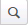

# Menu Editor

You use the Menu Editor to add or modify menus that are displayed in the navigation bar. A menu contains a list of groups or pages that provide access to the application functionality. Menu names have uppercase letters, such as CONFIGURATION and INVENTORY, and groups and pages are displayed as tabs in a horizontal navigation bar, or as options in a list in the vertical navigation bar.

Distributed web client menus are menus that are configured with groups and pages and are assigned to the corresponding roles that use the functionality. For example, the distributed Inventory Manager role is assigned to the INVENTORY menu.

**IMPORTANT**: It is highly recommended that you do not modify a distributed menu. These menus provide a view of all application functionality when logged in as a super user.  You can copy a menu to simplify your configuration tasks or refer to the distributed menus during application configuration.

A menu can include the following options:

-   **Groups**: A group is a list of pages. A group can be positioned on a menu, or within another group. You can add the following types of groups to a menu:
    -   **A new group**: Created when you build the menu. You can add a new group, and then select and add the pages and groups to include within the group.
    -   **A distributed group**: Distributed with the application and configured with groups and pages. When you add a distributed group, the associated pages and groups are immediately added to the menu.
-   **Pages**: A page is a webpage. You can add the following types of pages to a menu:
    -   **A user-defined page**: Created using Page Builder. A user-defined page is displayed in the list of available pages.
    -   **A distributed page**: Distributed with the application and included with the related distributed groups. A distributed page is also displayed in the list of available pages.

You assign a role to a menu to display the menu on the navigation bar for the role. You can also assign a role to a page. This is useful when multiple roles are assigned to a menu, and you want to limit individual page access to specific roles.

## Distributed page names

The pages that you can add to a menu are displayed within the Menu Editor in a list and are sorted alphabetically. To help identify a distributed page and to group pages by function, distributed page names include descriptive text followed by a forward slash (/). The text indicates the area of functionality in which the page is used.

The following examples illustrate the descriptive text provided with distributed pages:

-   **Configuration/Pick Cancellation**: The page that is used to configure how the application processes cancelling a pick.
-   **Picking Issues/Cancelled Picks**: The page that displays picks cancelled during picking operations.

The following notes apply to distributed page names:

-   The descriptive text is only used in the Menu Editor. It is not displayed on the page within the application or on the navigation bar.
-   Pages with names that are clearly identified, such as Return Processing and Inventory Adjustments, do not include any descriptive text.
-   Pages that are used in multiple functions, such as the Inventory or Work Queue pages, are labeled with **Shared/** to keep the pages grouped in the page list.

## View a menu

Use the Menu Editor to view the groups, pages, and role assignments for a menu.

1.  Select **Extensions > Menu Editor**.
    

**Note**: The number of pages and roles assigned to a menu is displayed in the grid.

3.  In the grid, click a menu name.
4.  To view which roles are assigned to the entire menu, view the **Roles** field.
5.  To view the groups that are distributed with the application:
    1.  Click **Next**.
    2.  Under **Groups**, click to expand the **Groups** list.
6.  To view the entire menu, including which roles are assigned to each page in the menu, click **Next**, and then click **Next**. The Review page is displayed listing a column that displays the groups and pages in the menu, and a column for each role that is assigned to the menu. A check mark indicates that a role is assigned to the page.

## Add or modify a menu

There is no character limit when adding a menu, group, or page display name; however, if the number of characters exceeds the navigation display width, the text is truncated and replaced by ellipses (...). You can preview the entire menu on the Review page to verify whether any names are too long, and then make updates prior to saving the menu.

1.  Select **Extensions > Menu Editor**.
    
2.  To add a new role, click **Manage Roles**, and then continue with [Add or modify a role](../system-administrator/authorization/roles.md).
3.  Perform one of the following tasks:
    -   To add a menu, click **Add**.
    -   To modify a menu, in the grid, click the menu name.
    -   To copy a menu, in the grid, select the menu row (without selecting the menu name), and then click **Copy**.
4.  Enter information in the following fields:
    
     
    | Field | Description |
    | --- | --- |
    | **Menu** | Name that is displayed in the drop-down list of the horizontal navigation bar, or at the highest level of the vertical navigation bar. The menu names are displayed in uppercase letters. |
    | **Description** | Text that provides additional information about the menu, such as its purpose, and why and how it is used. The description is not displayed in the navigation bar. |
    
5.  To assign roles that are authorized to use the menu:
    1.  Click the **Roles** field, and then select the check box next to the roles that apply.
        
        **Note**: If an existing role is not displayed in the list, assign the role to the user with which you are logged in. The Assign Roles window only displays roles that are already assigned to menus or to the current user.
        
    2.  Click **Select**.
6.  Click **Next**.
7.  To add a group to the menu, under **Groups**, perform one or more of the following steps:
    -   To add an existing group to the menu:
        1.  To expand the **Groups** list, click .
        2.  Select the check box next to the groups to add.
        3.  Click **Add to Menu**.
    -   To add a new group to the menu:
        1.  To expand the **Groups** list, click .
        2.  Click **Add Group**.
        3.  Enter a group name, and then click **Add**.
8.  To add a page to the menu, under **Pages**:
    1.  To expand the **Pages** list, click .
        
        **Note**: Page names include descriptive text to help identify the page. See [Distributed page names](#Distributed_page_names).
        
    2.  Select the check box next to the pages to add.
    3.  Click **Copy to Menu**.
        
        **Note**: You can only add a page to a menu once. Duplicate pages are not allowed within the same menu.
        
9.  To reorder the groups and pages on the menu, drag each page or group to the preferred location on the menu.
10.  To assign attributes to a group or page:
     1.  Click the group or page name.
     2.  To define the display name, in the **Name Displayed on Menu** field, enter a value.
     3.  To assign a role to a page, click . The Assign Roles window is displayed.
         
         **Note**: Assigning a role to a page restricts access for that page to the assigned role only. Other roles that are assigned to the menu cannot access the page.
         
     4.  Select the roles that apply.
     5.  Click **Apply**.
11.  Click **Next**.
12.  Review the menu:
     
     **Note**: Group names are displayed in italics and cannot have role assignments.
     
     1.  To assign another role to the menu:
         1.  Click **Assign roles**.
         2.  Select the check box next to the roles that apply.
         3.  Click **Select**.
             
             **Note**: A role assigned to the menu on this page does not have access to any pages assigned to specific roles. To change page-level role assignments, click **Back**.
             
     2.  To make changes, click **Back** to return to a previous page.
     3.  When finished, click **Finish**.

## Delete a menu

If you delete a menu and a user with a role assigned to the menu is currently logged into the application, the menu and pages remain available to the user only until the browser is reloaded (refreshed).

**IMPORTANT**: If a user is currently working on a page that is included in a deleted menu and reloads the browser, unsaved work will be lost.

1.  Select **Extensions > Menu Editor**.
    
2.  In the grid, select the menu row (without selecting the menu name).
3.  Click **Delete**. A confirmation message is displayed.
4.  Click **Yes**.

Supply Chain Execution Web Applications 2022.1.0.0 Help | Last updated: 31 May 2024

© 2014-2024 Blue Yonder Group, Inc. All rights reserved. [Legal notice](https://bf56-kms-wms-web-np2.jdadelivers.com/web/help/content/legal_notice.htm)

Contact: [Customer Support](https://success.blueyonder.com/ "Blue Yonder Customer Support") | [Services](https://blueyonder.com/services "Blue Yonder Services")
