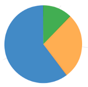
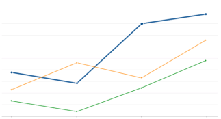
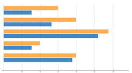
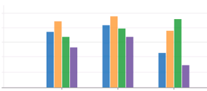
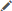

# Chart

A chart type page displays the category and value fields (defined for the chart) in a graphical format. A category field identifies a property in a web service that you want to display or track. A value field identifies a numeric attribute that has the values you want to display. Colors in the chart are automatically assigned by the application, and a legend is displayed to match a color to each value field. Users can show or hide data for a value field by clicking the label for the value field in the legend.

You can create the following types of charts:

-   **Pie**: A type of graph in which a circle is divided into sectors that each represent a proportion of the whole. Each slice is a different color and represents a percentage of the entire pie. This type of chart is useful for showing values in proportion to one another. It represents only one value field, and is most effective when the value field has less than eight values. For example, you could use a pie chart to display storage locations (selected as the category field) by their utilization status (selected as the value field) of full, empty, partially filled, and overfilled.
    
    
    

-   **Line**: A graph that displays data as points connected by straight line segments. If multiple value fields are tracked for comparison, each value field label is displayed in a separate line and different color. The line chart is useful for displaying trends in data over time. When you select a category field that represents a period of time, the category values are displayed on the horizontal axis, the value field labels are displayed in the legend, and the numeric values are displayed on the vertical axis. For example, you could use a line chart to track by date (selected as the category field) inventory quantity expected, inventory quantity received, and inventory quantity stored (selected separately as value fields).
    
    
    

-   **Bar and Column**: Graphs that display either horizontal (bar) or vertical (column) rectangles to represent data. Bar and column charts provide a similar view of data using either a horizontal or vertical orientation. If multiple value fields are tracked, each value field is displayed in a different color. The bar and column charts are useful for comparing multiple value fields. For example, you could use a column chart to display inventory counts (selected as the category field), comparing the accurate and failed inventory counts (selected separately as value fields).
    -   **Bar**: On a bar chart, the value field labels are displayed on the vertical axis and the numeric values are displayed on the horizontal axis. You might choose a bar chart instead of a column chart if the value field labels are long and hard to read along the horizontal axis.
        
        
        
    -   **Column**: On a column chart, value field labels are displayed on the horizontal axis and the numeric values are displayed on the vertical axis. You might choose a column chart instead of a bar chart if the data includes negative numbers for easier comprehension.
        
        
        

When you configure a chart type page, in addition to the chart type, title, and description, you define the following components:

-   **Resource**: Web service end point that provides the data used on the page. A resource can be one of the distributed resources or a user-defined resource. Before creating a page, you must have a resource to associate with the page.
    
    **Note**: A user-defined resource can be a Java-based web service written using the MOCA web service framework, or a Configurable Web Service that uses MOCA components, commands, and configuration files. See the information on web services and Configurable Web Services in the MOCA Developer Guide.
    

-   **Category and Value Fields**: Properties within the selected resource that are provided by the associated web service.
    -   The **Category Field** identifies the entity that you want to display or track, such as storage locations, inbound inventory, or inventory counts. For line, bar, and column charts, the Category Field can alternatively identify an entity that represents a period of time to display or track data, such as a date or time period.
    -   The **Value Field** identifies a numeric attribute, such as a status, quantity field, or type. For example, if inbound inventory is the category, then you could specify three value fields to display expected quantities, received quantities, and stored quantities.
        
        **Note**: All data aggregation and calculations displayed on a chart must be provided by the web service. For example, to display average received quantities, the web service must calculate and provide the averaged values.
        
-   **Minimum and Maximum**: Values used to control the chart's scale for a line, bar, or column chart. If left blank, the application calculates minimum and maximum values to ensure data from all selected value fields is displayed.
-   **Full Data Resource:** Web service end point to use to support mapping aggregated chart resource parameters to full data resource parameters. A full data resource provides an expanded data set to use when configuring chart value navigation links and applying ad-hoc filters to limit data that is displayed on the destination page.
    
    **Note**: A full data resource is user defined as either a Java-based web service written using MOCA web service framework, or a Configurable Web Service that uses MOCA components, commands, and configuration files. See the information on web services and Configurable Web Services in the MOCA Developer Guide.
    
-   **Labeling**: Message text for the labels on the page to use instead of the distributed message name.
    

After you add a chart type page, you must either add the page to a menu and assign roles that can access the page, or add the page to a dashboard type page.

## Add or modify a chart type page

1.  Select **Extensions > Page Builder**.
    

1.  Perform one of the following tasks:
    -   To add a chart, from the **Actions** drop-down list, select **Add Chart**.
    -   To modify a chart, in the grid, click the title.
    -   To copy a chart, in the grid, select the page row (without clicking the title), and then from the **Actions** drop-down list, select **Copy**.
2.  Enter information in the [Chart fields](#Chart_fields).
3.  To select a full data resource and map the full data resource properties to the chart resource properties:
    1.  From the **Select Full Data Resource** drop down list, click , and select a resource.
        
        **Note**: A list of fields, which are properties from the chart resource, is displayed. If the fields are missing, select a value in the **Select Resource** field.
        
    2.  From a field drop-down list, select a full data resource value that corresponds to the chart resource property.
        
        **Notes**:
        
        -   Only full data resource values that match the data type of the chart resource property are displayed in the list.
        -   If you are modifying an existing chart type page that uses navigation links, you must reconfigure the links after selecting and mapping properties of a full data resource. See [Add or modify a chart type page layout configuration](#Add_or_modify_a_chart_type_page_layout_configuration).
        
4.  If the page is new or you have selected a different resource for an existing page, then click **Save**. The Edit Labels page is displayed.
5.  To define labels:
    1.  If the Edit Labels page is not displayed, click **Labeling**.
    2.  To copy a label:
        1.  In the grid, select the check box next to the name to copy, and then click **Copy**.
        2.  Enter information in the [Message fields](../message-editor.md).
        3.  Click **Save**.
    3.  To copy multiple labels:
        1.  In the grid, select the check box next to the names to copy, and then click **Copy**.
        2.  Enter information in the [Bulk copy fields](../message-editor.md).
        3.  Click **Save**.
    4.  To delete a label, in the grid, select the check box next to the names to delete, and the click **Delete**. A confirmation message is displayed.
    5.  To edit message text for a label, in the grid, click , enter the message text and click **Save**, or to edit the next label, click **Save & Next**.
6.  Click  to close.
7.  To test the page:
    1.  If the Edit Charts page is not displayed, in the grid, click the chart title.
    2.  Click **Preview**.
    3.  Review the information on the page.
    4.  In the legend, click a label to hide the category and values on the chart and click it again to show the category and values.
    5.  Click **Back**.
8.  Click **Save**.
9.  To continue with additional page layout configuration:
    -   To add the page to a menu, see [Add or modify a menu](../menu-editor.md).
    -   To configure the page, see [Add or modify a chart type page layout configuration](#Add_or_modify_a_chart_type_page_layout_configuration).

## Add or modify a chart type page layout configuration

You can configure a page that was created using Page Builder and added to a menu. See [Add or modify a menu](../menu-editor.md).

1.  Open the page.
2.  In the page title bar, click . The Chart Configuration page is displayed.

1.  Under **Configurations**, perform one of the following tasks:
    -   To add a configuration, click **Add**.
    -   To copy a configuration, select a configuration, and then click **Copy**.
    -   To modify a configuration, select the configuration.
2.  Under **CONTEXT**, enter information in the [Context fields](#Context_fields).
    
    **Note**: Only one unique combination of warehouse, menu, and client can exist per configuration.
    

1.  To configure navigation links for a chart value:
    1.  Under **Properties**, click **Configure Series**.
    2.  In the **Select Series** column, select the check box next to the series for which to add navigation links.
    3.  Select the value, and then click **Configure Link Navigation**.
    4.  In the **Select Page** column, select the check box next to the pages to which the values in the chart are linked.
    5.  To reorder the selected pages, drag each page to the position you want.
    6.  To configure ad-hoc filters to limit the data that is displayed on the destination page, from a field drop-down list, select the field from the source page that matches the field on the destination page. For example, if the destination page has an order field, then from the order drop-down list, select order (if it is available from the source page) to filter the results displayed on the destination page by a specific order number. See [Grid and chart navigation link configuration](grid.md).
        
        **Notes**:
        
        -   The value selected from the drop-down list must match the label of the drop-down list for an ad-hoc filter to work.
        -   If you have modified a chart type page to use a full data resource, you must reconfigure the links to ensure that the correct source page properties are selected.
        
    7.  Click **Apply**.
    8.  Click Apply.
2.  Click **Save**.
3.  Click  to close.

## Chart fields

 
| Field | Description |
| --- | --- |
| **Title** | Text to display at the top of the page. |
| **Description** | Text that provides additional information about the page, such as its purpose, and why and how it is used. The description is not displayed on the page. |
| **Select Resource** | Web service end point to use to support summary information that is displayed on the chart. |
| **Chart Type** | Type of chart. -   •
    
    **Pie**: A type of graph in which a circle is divided into sectors that each represent a proportion of the whole. Each slice is a different color and represents a percentage of the entire pie. This type of chart is useful for showing values in proportion to one another. It represents only one value field, and is most effective when the value field has less than eight values. For example, you could use a pie chart to display storage locations (selected as the category field) by their utilization status (selected as the value field) of full, empty, partially filled, and overfilled.
    
     
    
    
    
     
 -   •
    
    **Line**: A graph that displays data as points connected by straight line segments. If multiple value fields are tracked for comparison, each value field label is displayed in a separate line and different color. The line chart is useful for displaying trends in data over time. When you select a category field that represents a period of time, the category values are displayed on the horizontal axis, the value field labels are displayed in the legend, and the numeric values are displayed on the vertical axis. For example, you could use a line chart to track by date (selected as the category field) inventory quantity expected, inventory quantity received, and inventory quantity stored (selected separately as value fields).
    
     
    
    
    
     
 -   • **Bar and Column**: Graphs that display either horizontal (bar) or vertical (column) rectangles to represent data. Bar and column charts provide a similar view of data using either a horizontal or vertical orientation. If multiple value fields are tracked, each value field is displayed in a different color. The bar and column charts are useful for comparing multiple value fields. For example, you could use a column chart to display inventory counts (selected as the category field), comparing the accurate and failed inventory counts (selected separately as value fields).
    -   •
        
        **Bar**: On a bar chart, the value field labels are displayed on the vertical axis and the numeric values are displayed on the horizontal axis. You might choose a bar chart instead of a column chart if the value field labels are long and hard to read along the horizontal axis.
        
         
        
        
        
         
     -   •
        
        **Column**: On a column chart, value field labels are displayed on the horizontal axis and the numeric values are displayed on the vertical axis. You might choose a column chart instead of a bar chart if the data includes negative numbers for easier comprehension.
        
         
        
        
        
         
      |
| Category Field | Identifier of the data to display on the chart. A category field is a property within the selected resource that is provided by the associated web service. You select one category field per chart. For example, storage locations, inbound inventory, or inventory counts are all category fields.  For line, bar, and column charts, the Category Field can alternatively identify a period of time to display or track data, such as a date or time period. |
| Value Field | One or more numeric attributes that are used to provide the chart's values. You can display more than one value field in the chart by selecting each additional value field's identifier. A value field is a property within the selected resource that is provided by the associated web service.  **Note**: If you are creating a pie chart, select only one value field. |
| Minimum | Minimum value to display on the axis that corresponds to the chart's value fields. If left blank, the application calculates a minimum value to ensure data from all selected value fields is displayed. You can modify this value to change the chart scale. This field only applies to line, bar, and column charts.  **Note**: When modifying the chart scale, you must specify both the **Maximum** and **Minimum** values. |
| Maximum | Maximum value to display on the axis that corresponds to the chart's value fields. If left blank, the application calculates a maximum value to ensure data from all selected value fields is displayed. You can modify this value to change the chart scale. This field only applies to line, bar, and column charts.  **Note**: When modifying the chart scale, you must specify both the **Maximum** and **Minimum** values. |
| Select Full Data Resource | Web service end point to use to support mapping aggregated chart resource parameters to full data resource parameters. A full data resource provides an expanded data set to use when configuring chart value navigation links and applying ad-hoc filters to limit data that is displayed on the destination page.  When a full data resource is selected, the available parameters for the full data resource are displayed as drop-down lists. The values in a drop-down list represent chart resource parameters that match the full data resource parameter data type. For example, if the chart resource parameter was _escalationTime_ drop-down list, only numeric parameters from the full data resource are displayed in the list. |

## Context fields

 
| Field | Description |
| --- | --- |
| **Extension ID** | Unique internal identifier for an entity (such as a field, action, or page) that is enabled for extensibility. The extension ID identifies the entity, configurations, and if the entity is used within a variety of functions within the application, specific use of the entity in the application. |
| **Site** | Warehouse to which the configuration applies. The combination of site (warehouse), menu, and subsite (client) defines the context in which the configuration takes effect. |
| **Menu** | Application module to which the configuration applies. The combination of site (warehouse), menu, and subsite (client) defines the context in which the configuration takes effect. |
| **Subsite** | Client to which the configuration applies. The combination of site (warehouse), menu, and subsite (client) defines the context in which the configuration takes effect. |

Supply Chain Execution Web Applications 2022.1.0.0 Help | Last updated: 31 May 2024

© 2014-2024 Blue Yonder Group, Inc. All rights reserved. [Legal notice](https://bf56-kms-wms-web-np2.jdadelivers.com/web/help/content/legal_notice.htm)

Contact: [Customer Support](https://success.blueyonder.com/ "Blue Yonder Customer Support") | [Services](https://blueyonder.com/services "Blue Yonder Services")
