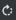

# Operations

When you work with report operations, you can perform the following tasks:

-   Generate and view a PDF version of a report.
-   Change the appearance of a report on your computer display, for example, to zoom in or out.
-   Generate a report URL to bookmark.
-   Print a report.
-   Export report data to your computer in several different formats: CSV, HTML, Microsoft Excel (XLS), and PDF.

**IMPORTANT**: To view and generate reports, Warehouse Reporting must be installed and integrated with the Blue Yonder application.

## Preview a report

**IMPORTANT**: To view and print a report, Warehouse Reporting must be installed and integrated with the Blue Yonder application.

1.  Select **System Administrator > Reports/labels > Operations**.
    

1.  In the grid, click the report.
2.  In the **Days to Keep** field, enter the number of days to keep the generated report in the report archive.
3.  To send an alert to Event Management when the report is generated, set the **Send Alert** field to Yes.
4.  If available, enter information in the report criteria fields.
    
    **Note**: The report criteria fields vary depending on the selected report.
    

1.  Click **Preview**.

1.  To use the PDF toolbar options, point to the title of the report until the PDF toolbar is displayed, and then perform any of the following tasks:
    -   To view a different page of the PDF, select the current page number, and enter a different page number.
    -   To turn the display clockwise, click **Rotate Clockwise** .
    -   To download the PDF, click **Download** .
    -   To print the PDF, click **Print** , select the destination and pages to print, and then click **Save** or **Print**.
    -   To display a full page, click **Fit to page** .
    -   To display the full width of a page, click **Fit to width** .
    -   To enlarge the display, click **Zoom in** .
    -   To reduce the display, click **Zoom out** .

1.  To print the report and then close the report window:
    1.  Enter information in the [Print fields](#Print_fields).
    2.  Click **Print**. A confirmation message is displayed.
    3.  Click **OK**.
2.  To close the report window without printing the report, click **Cancel**.

## Print a report with or without digital signature capture

**IMPORTANT**: To print a report, Warehouse Reporting must be installed and integrated with the Blue Yonder application.

1.  Select **System Administrator > Reports/labels > Operations**.
    

1.  In the grid, click the report.
2.  In the **Days to Keep** field, enter the number of days to keep the generated report in the report archive.
3.  To send an alert to Event Management when the report is generated, set the **Send Alert** field to Yes.
4.  If available, enter information in the report criteria fields.
    
    **Note**: The report criteria fields vary depending on the selected report.
    

1.  Click **Print**.
2.  Enter information in the [Print fields](#Print_fields).
3.  Click **Print**. A confirmation message is displayed.
4.  Click **OK**.

## Bookmark a report

You can generate report URLs and access them through the browser's bookmarks.

**IMPORTANT**: To view and print a report, Warehouse Reporting must be installed and integrated with the Blue Yonder application.

1.  Select **System Administrator > Reports/labels > Operations**.
    

1.  In the grid, click the report.
2.  In the **Days to Keep** field, enter the number of days to keep the generated report in the report archive.
3.  To send an alert to Event Management when the report is generated, set the **Send Alert** field to Yes.
4.  If available, enter information in the report criteria fields.
    
    **Note**: The report criteria fields vary depending on the selected report.
    

1.  Click **Preview**.
2.  Click **Bookmark**. A URL specific to the report is generated.
3.  Click **OK**.
4.  Bookmark the generated URL in the browser.
5.  If the report criteria fields are edited, then to regenerate the report URL:
    
    1.  Click **Preview**.
    2.  Click **Edit Bookmark**.
    3.  Click **Yes**. The report URL is updated.
    4.  Bookmark the URL in the browser.

## Export a report

**IMPORTANT**: To export a report, Warehouse Reporting must be installed and integrated with the Blue Yonderapplication.

1.  Select **System Administrator > Reports/labels > Operations**.
    

1.  In the grid, click the report.
2.  In the **Days to Keep** field, enter the number of days to keep the generated report in the report archive.
3.  To send an alert to Event Management when the report is generated, set the **Send Alert** field to Yes.
4.  If available, enter information in the report criteria fields.
    
    **Note**: The report criteria fields vary depending on the selected report.
    

1.  Click **Export**.
2.  Select the export format:
    -   **PDF**: Adobe Acrobat Portable Document Format. Acrobat Reader is required to view PDF files.
    -   **HTML**: HyperText Markup Language; standard for indicating formatting in webpages. You can view this file in a text editor, HTML editor, or web browser.
    -   **CSV**: Comma Separated Values format. You can view this file in a text editor, such as Microsoft Notepad or a spreadsheet program, such as Microsoft Excel.
    -   **EXCEL**: Proprietary format of a Microsoft Excel spreadsheet (an XLS file). Excel is required to view and edit XLS files.
3.  Click **OK**. The report is either opened in the default program for the format selected or is downloaded to your computer.

## Print fields

 
| Field | Description |
| --- | --- |
| **Printer** | Device to use to print the report. This field is required if you are printing a physical copy of the report. |
| **Copies** | Number of copies of the report to print. |
| **Print Report and Send for Digital Signature** | If Yes, the report will be both printed and sent (electronically) to the digital signature capture application.  This field is only available if this instance is integrated with a third-party digital signature capture application, and the selected report is enabled and configured for capturing digital signatures. See [Digital signatures](reports.md). |
| **Send for Digital Signature** | If Yes, the report will be sent (electronically) to the digital signature capture application.  This field is only available if this instance is integrated with a third-party digital signature capture application, and the selected report is enabled and configured for capturing digital signatures. See [Digital signatures](reports.md). |

Supply Chain Execution Web Applications 2022.1.0.0 Help | Last updated: 31 May 2024

© 2014-2024 Blue Yonder Group, Inc. All rights reserved. [Legal notice](https://bf56-kms-wms-web-np2.jdadelivers.com/web/help/content/legal_notice.htm)

Contact: [Customer Support](https://success.blueyonder.com/ "Blue Yonder Customer Support") | [Services](https://blueyonder.com/services "Blue Yonder Services")
