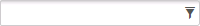
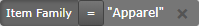
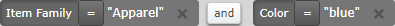

# Filters

A filter consists of one or more values (criteria) that are used to limit the display of information to that which matches the criteria. For example, if a grid displays a list of items, you can enter criteria in the filter field to limit the display to items that match your criteria.

## Filter field entries

You use a filter field to enter criteria to search for and display information that matches your criteria.

The following image is an example of the filter field.

When you enter a value in the filter field, you must select an attribute to which it applies. For example, on an inventory display, to find all inventory in the Apparel item family, you can enter the word **Apparel** and then select **in Item Family**.

**Note**: The list of attributes may be sorted or filtered to match the value that you enter. For example, if you enter a date value, fields that contain a date are listed at the top of the list.

The following image is an example of the criteria that is created and displayed above the grid as an ad-hoc filter.

Depending on the type of attribute that you selected, you can access additional operators to modify the criteria. Click  to display the following operators: ≠, <, >, ≤, and ≥.

You can add multiple criteria to the ad-hoc filter. For example, you can also enter **Color:blue** to further limit the list of displayed apparel items to those with the color blue. The following image is an example of multiple criteria in an ad-hoc filter.

**IMPORTANT**: Do not use **or** when combining filter criteria. Ad-hoc filters do not allow for order of precedence or grouping, so results displayed when using **or** (rather than the **and** button) may not match what is expected.

You can also save a defined ad-hoc filter. Saved filters can be identified as favorites and accessed quickly using the **Load Saved Filter**  button. A saved filter is only available for use on the page for which it was created. You can modify, copy, or rename a saved filter, as well as make it the default filter for a page and share it with other users. See [Work with filters](work-with-filters.md).

### Valid filter field values

The filter field accepts the following values:

-   Plain text and numbers
-   Quotation marks **" "** and wildcard **\***: Use these characters to ensure the results you want display.
    

When you use a wildcard character, you override the application-applied wildcard filtering. Depending on your configuration, the application may process your search text with a suffix wildcard (\* at the end), a prefix and suffix wildcard (\* at the beginning and end), or no wildcard at all. See the wildcard filtering information in the _Supply Chain Execution Applications Administrator Guide_.

**Note**: To avoid performance issues, application-applied wildcard filtering is disabled on pages that query large data sets (such as Inventory Display and Outbound Orders).

-   Special characters:
    
    **Note**: The special characters listed below are reserved words and are changed to the indicated words when used in a filter. For example, a plus sign is changed to AND. To prevent a special character from being changed to its reserved word, use quotation marks around the value, or the value in which it is used. For example, to find the item number 10+210 (where the + is a character in the item number), enter **Item: "10+210"**. Without the quotation marks, + is changed to AND, and the results display item numbers that end or start in 10 and 210.
    
    -   Equal sign or colon: Use either character to indicate "equal to".
    
    **Note**: If you know the attribute name, use the format <_Attribute_>**:**_<Keyword>_ or _<Attribute>_**\=**_<Keyword>_ to save the time it takes to locate the attribute in the list.
    
    -   Plus sign or comma: Use either character to indicate "and". For example, **Color:blue+green** will display items that are blue green and green blue.
        
        **Note**: When you use **the plus sign, comma,** or the word "and" in the filter field, the results that are displayed are based on the application wildcard match, not an exact match.
        
    -   Pipe character: Use the **|** character to indicate "or". For example, **Color:blue|green** will display items that are blue, green, and blue green.
        
        **Note**: When you use **|** or the word "or" in the filter field, the results that are displayed are based on the application wildcard match, not an exact match.
        
-   True, false, yes, no: Use these terms for columns that display binary values, such as a check mark. Field types that display binary values include a check box, a toggle field, or a radio button (in some cases). You can enter **true** or **yes** (indicates a value) or **false** or **no** (indicates blank).
    
    **Note**: Criteria that contains a binary value attribute does not include the  button. You can still modify the filter to the opposite state by clicking the filter, and selecting from one of the displayed options.
    
-   None, null: Use these terms to display results in which a non-binary field is empty.
-   Dates, date ranges, and relative dates:
    
    -   Date ranges (MM/DD/YY to MM/DD/YY)
        
        **Note**: Use the Search Date/Duration toolbar, when available, to perform the same search as entering date ranges in the filter field.
        
    -   **Today**, **tomorrow**, and **yesterday**
    -   Calendar days of the week, such as **monday** and **tuesday**
    -   Calendar days in specific weeks, such as **last monday**, **this tuesday**, and **next wednesday**
    -   Specific weeks, months, or years, such as **last week**, **this month**, and **next year**
-   Numbers of minutes, hours, days, weeks, months, or years in the past or future:
    -   Next <_Number_> minutes, such as **next 5 minutes**
    -   Last <_Number_> days, such as **last 4 days**

## Multiple values in a filter

From a filter field on a grid, you use the **Filter using multiple fields** button to filter information on a page by accessing a window on which you can enter a value for one or more attributes. If any attribute has an asterisk (\*), you must enter a value for that attribute to display information on the grid. The **Filter using multiple fields** button is not available on all pages.

## Quick filters

You use quick filters to filter information on a page using pre-defined criteria. You apply a quick filter by selecting it from the **Quick Filters** drop-down list. Quick filters are distributed with the application and cannot be modified or deleted. The **Quick Filters** drop-down list is not available on all pages, and the filters available are specific to a page.

**Note**: When you select a quick filter, the filter is added to the currently applied filters. A quick filter does not replace filters that are already applied.

## Filter field examples

The following table shows examples for entering values to display specific results on an inventory display.

 
| Entry | Displayed Results |
| --- | --- |
| Item:\*Batteries\* | Rows with any item that contains "Batteries", such as: -   • BATTERIESA
 -   • BATTERIESAA
 -   • BATTERIESAAA
 -   • BATTERIESC
 -   • BATTERIESD
 -   • LI\_BATTERIES |
| Item:Batteries\* | Rows with any item that starts with "Batteries", such as: -   • BATTERIESA
 -   • BATTERIESAA
 -   • BATTERIESAAA
 -   • BATTERIESC
 -   • BATTERIESD |
| Item:"BatteriesA" | Rows with BATTERIESA item only |
| Item:"BatteriesA"|"BatteriesC" | Rows with BATTERIESA or BATTERIESC items |
| Item:"BatteriesA" or "BatteriesC" | Rows with BATTERIESA or BATTERIESC items |
| Item:BatteriesA|BatteriesC | Rows with any of the following items: -   • BATTERIESA
 -   • BATTERIESAA
 -   • BATTERIESAAA
 -   • BATTERIESC |
| Item Family:none | Rows with **Item Family** fields that are blank |
| Item Family:null | Rows with **Item Family** fields that are blank |
| Item Family:\* | Rows with **Item Family** fields that contain a value |
| Required:true | Rows with **Required** fields that contain a value, such as a check mark |
| Required:yes | Rows with **Required** fields that contain a value, such as a check mark |
| Expiration Date:today | Rows with **Expiration Date** fields that contain the current day's date |
| Late Ship Date: <_Date_> to <_Date_>, such as  MM/DD/YY to MM/DD/YY  **Note**: The date format may vary by locale. | Rows with **Late Ship Date** on or within the range |

Supply Chain Execution Web Applications 2022.1.0.0 Help | Last updated: 31 May 2024

© 2014-2024 Blue Yonder Group, Inc. All rights reserved. [Legal notice](https://bf56-kms-wms-web-np2.jdadelivers.com/web/help/content/legal_notice.htm)

Contact: [Customer Support](https://success.blueyonder.com/ "Blue Yonder Customer Support") | [Services](https://blueyonder.com/services "Blue Yonder Services")
