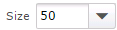

# Grids

Information on a page in the application can be displayed in a grid. A grid presents the information in a tabular format with rows and columns. In a grid you can perform the following tasks:

-   Adjust pages in a grid
-   Adjust columns in a grid:
    -   Show or hide a column
    -   Sort information in ascending or descending order by column
    -   Adjust the width of a column
    -   Move a column to a different position in the table
-   Select multiple rows
-   Take actions on selected rows

## Adjust pages in a grid

The grid pagination toolbar is located at the bottom of a grid and has the following controls to adjust what pages a grid displays:

-   **Page controls**: Displays the current page number and may display the total number of pages. You can click to navigate to the first page , the previous page, a specific page number (enter a page number and then press **Enter**), the next page , and the last page  in the grid. The following image is an example of the page controls.

 

-   **Display range**: Displays the row numbers for the current page and may display the total number of rows in the grid; for example, Displaying 21 - 40 of 80.
-   **Size**: Defines the number of rows displayed per page. To define the number of rows that are displayed on a page, in the **Size** field, enter a value or select a value from the drop-down list. The following image is an example of the **Size** field.

-   **Scroll bars**: When the data display exceeds the size of the page, use the scroll bars to view additional rows and columns.

## Adjust columns in a grid

You can choose the columns to display, sort the column data, adjust the width of a column, and reposition columns in the grid. When the content of a grid spans multiple pages, you use the grid navigation toolbar to define the number of rows per page to display, and move between pages.

1.  Open a page that displays columns in a grid.
2.  To show or hide columns:
    1.  Point to the column title, click , and then select **Columns**.
    2.  Select the check box next to each column to display in the grid. Deselect the check box next to each column to hide in the grid.
    
    **Note**: The grid is immediately updated as you select and deselect check boxes.
    
3.  To sort the information in a table by column values, perform one of the following tasks:
    -   Click the column title by which you want to sort. Click the column title again to sort in the opposite order.
    -   Point to the column title, click , and then select **Sort Ascending** or **Sort Descending**.
4.  To adjust the width of a column, point to the edge of a column title, and then using the double-sided arrow, drag the edge of the column to the size you want.
5.  To move a column, point to the column title, and then drag the column to the location you want.

## Select multiple rows

You can select a row or multiple rows within a grid to perform actions on. To select multiple rows, if allowed:

1.  Open a page that displays columns in a grid.
2.  Perform one of the following tasks:
    -   To select all displayed values, select the check box in the column title row.
    -   To select specific values, select the check box next to the values.
    
    **Note**: In the grid, press and hold **Shift** to select consecutive values or press and hold **Ctrl** to select nonconsecutive values.
    

## Take actions on selected rows

You can perform actions on a multiple selected rows or a row. An action is a task that a user can perform in the web client. On the user interface, an action can be displayed as a button or as a link on a page, a window, an **Actions** drop-down list, and a tag tooltip.

Supply Chain Execution Web Applications 2022.1.0.0 Help | Last updated: 31 May 2024

© 2014-2024 Blue Yonder Group, Inc. All rights reserved. [Legal notice](https://bf56-kms-wms-web-np2.jdadelivers.com/web/help/content/legal_notice.htm)

Contact: [Customer Support](https://success.blueyonder.com/ "Blue Yonder Customer Support") | [Services](https://blueyonder.com/services "Blue Yonder Services")
