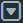

# User interface

The user interface is the web client window that is displayed when you log in to the application. The web client window provides navigation to and displays application pages. It also provides functions for managing user settings and accessing online help.

## Title bar

The title bar is displayed at the top of the web client window. It provides access to user settings, online help, and the search field. Its location and content are fixed so that you do not need to scroll to the top of the window to access the available functionality. However, while it is always displayed, the functionality is not available when completing a task flow or viewing a secondary window opened from a page. The title bar contains the following elements:

-   **User name**: This drop-down list provides access to options for changing your password, setting a preferred time zone, and logging out of the application. You can change the time zone used to display date and time information in the web client by selecting **Change Time Zone**.

**Note**: Changing the time zone requires logging out for the new time zone to take effect.

-   **Warehouse name**: This button is labeled with the name of the current warehouse. In a multi-warehouse or third-party logistics (3PL) environment, you can click this button to display the Change Site page. Users authorized for multiple warehouses can select a different warehouse. Users authorized for multiple clients can select the clients for whom they need access.
-   **Workstation name**: This button is only displayed when working with warehouse functionality. It is not displayed, for example, when performing administration, authorization, or Event Management tasks. This button is labeled with the name of the user's workstation, if specified. You can click this button to display the Select Workstation page and select your workstation. See [Workstations](../warehouse-management/configuration/equipment/hardware/workstations.md).
-   **Help** : This button displays the Supply Chain Execution Web Applications Help. See [Help](help.md).
-   **Search** :This button displays the Search field in which you can enter a word or phrase to locate a page. See [Search for a page](work-with-pages.md).

## Navigation bars

Navigation bars provide access to application functionality through the following options:

-   **Menus**: A menu is a collection of groups or pages. Menu names have uppercase letters, such as CONFIGURATION and INVENTORY.
-   **Groups**: A group is a list of pages. Groups are preceded or followed by a small arrow to indicate that you can expand the group.
-   **Pages**: A page displays a webpage. You use a webpage to view or perform tasks within the application.

You can access menus, groups, and pages through a horizontal or vertical navigation bar, depending on how your application is configured. However, while it is always displayed, the bar is not available when completing a task flow or viewing a secondary window opened from a page.

**Using the horizontal navigation bar configuration**

The horizontal navigation bar is displayed under the title bar on the web client window and enables you to select a menu to display the related groups and pages. Its location and content are fixed so that you do not need to scroll to the top of the window to access the available tabs.

The horizontal navigation bar contains the following elements:

-   **Menu drop-down list**: Enables you to select the menu in which you are going to work. The menu is displayed in the left-most position on the navigation bar. Depending on your defined user permissions, you can have one or more menus available for selection.
-   **Tabs**: Enable you to select a page or group from the selected menu. Tabs are displayed to the right of the menu drop-down list in the navigation bar. When you select a tab with only one page, the page is displayed below the navigation bar. When you select a tab with a group, a navigation pane is displayed below the navigation bar.
-   **Display more button**: If displayed, indicates that additional tabs are available but cannot be displayed on the navigation bar. Point to  to view and select from the list of additional tabs.
-   **Hide title bar button**: Enables you to hide the title bar so that more of the application page is displayed. Click  to hide the title bar and click  to show a hidden title bar.

**Using the vertical navigation bar configuration**

The vertical navigation bar is displayed on the left side of the web client window. You click  to show or hide the vertical navigation bar. When you select a menu, groups and pages are displayed in a list. Groups are preceded by a small arrow and you can click a group to show or hide the pages in the group. When the vertical navigation bar is open, you can click  to keep the navigation bar open or allow it close automatically after a selection is made.

## Application pages

A web client page represents a workspace for a particular configuration, operation, process, or display. A page is persona-based and provides one or more of the following elements:

-   **Navigation trail**: Displays navigation to parent pages associated with the current page. You can click a page in the trail to return to it.
-   **Page title bar**: Displays the page title and, for child pages, provides a back button  you can click to return to the previous page.

On pages that display data, you can refresh, print, and export the data. See [Set page refresh](work-with-pages.md), [Print a page view](work-with-pages.md), and [Export data](work-with-pages.md).

-   **Grid**: Displays data in columns and rows. See [Grids](grids.md).
-   **Filter**: Limits the display of information on a page or grid. See [Filters](filters.md).
    
-   **Hyperlinks**: Provide access to another page or window. Hyperlinks are blue and typically available in grids. When you point to a hyperlink, the pointer becomes a hand icon.
-   **Media**: Displays visual information when an entity (such as a user or item) has a media file associated with it. See [Media](media.md).
    

When you work on a page, you use the following elements to perform tasks or enter data:

-   **Buttons**: You can click a button to perform a task. The **Action** button displays a drop-down list of available tasks.
-   **Date and time fields**: You can select from one or two calendars for date or date range selection, or from a list for time selection. See [Select a date, date range, and time](work-with-pages.md).
-   **Fields**: When you work in fields, you may observe the following attributes:
    -   **Focus**: On pages that support user entries, a field with a blue outline indicates the current data entry point.
    -   **Required fields**: An asterisk (\*) next to a field name indicates that the field requires a value.
    -   **Invalid entries**: If a field contains an invalid entry or a required field is left blank, the field border turns red and the field is marked with an **Invalid** icon . You can point to the  icon to display a tooltip that explains why the entry is invalid.
    -   **Slide-out help**: Slide-out, or context-sensitive help, is available for select fields within a page to provide immediate information that describes the purpose of a field, the type of information required, and when required, a basic level of instruction. Slide-out help is available for a field when an information  icon is displayed next to it. When you click , a help panel slides out from the right side of the web client window. The slide-out help remains open until you close it or navigate to another page.

## Session expiration

For security reasons, the application expires a web client session.

### Session expiration due to inactivity

If you stop actively working with the web client window for a period of time (default is 10 minutes), your browser session expires and requires you to re-enter your login credentials. However, before that occurs, a session expiration warning is displayed that includes a countdown of the number of seconds that remain until your session expires. If this warning is displayed, you can return to your workspace by clicking **Continue** or end your session by clicking **Logout**.

If the session expiration warning counts down to zero, your session expires, and the Session Expired window is displayed. When this occurs, to return to the same page displayed in the web client window before the session expired, enter your user name and password, and then click **Sign In**.

### Session expiration due to exceeding the session time limit

The application is configured with a browser session time limit. If you are working in the web client window and reach the limit (default is 480 minutes or 8 hours), your browser session expires and requires you to re-enter your login credentials. Before that occurs, a session expiration warning is displayed that indicates you have a number of seconds before your session expires. You do not have the option to continue the current session, so unsaved changes will be lost.

If you try to perform a task in the workspace after the session expires, then the Session Expired window is displayed. To start a new session, enter your user name and password, and then click **Sign In**.

## Log in and out of the web client

You access the web client window using a web browser.

**IMPORTANT**: To access web client functionality, a user must have a role assigned that provides access to web client menus. During login, if the user's role does not have permission to view any menu, an error message is displayed and the login fails. Contact your system administrator for assistance with user and role configurations.

1.  To log in:
    1.  Log in to the workstation used to access the web client.
    2.  Start the web browser.
    3.  In the address field, enter `` `http://`**<**`Host Name`**>:<**`Port Number` >  ``. The login page is displayed.
    4.  Enter your user name and password, and then click **Sign In**. Your session starts and your user name is displayed in the title bar.
2.  To log out, in the title bar, from the user name drop-down list, select **Logout**.

Supply Chain Execution Web Applications 2022.1.0.0 Help | Last updated: 31 May 2024

© 2014-2024 Blue Yonder Group, Inc. All rights reserved. [Legal notice](https://bf56-kms-wms-web-np2.jdadelivers.com/web/help/content/legal_notice.htm)

Contact: [Customer Support](https://success.blueyonder.com/ "Blue Yonder Customer Support") | [Services](https://blueyonder.com/services "Blue Yonder Services")
