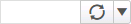
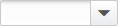

# Work with pages

You can use the search field to navigate to a page. You can also export information, manage page-specific settings, and select fields within an application page.

## Search for a page

To use the search field on the title bar, you must enter all or part of a word or phrase used in the path to the page.

A path consists of the menu and groups used to navigate to a page. For example, "Configuration > Inventory > Units of Measure" represents a path in which "Configuration" is a menu, "Inventory" is a group, and "Units of Measure" is a page.

1.  In the title bar, in the search field, enter any of the following values:
    
    -   All or part of a word in the path. For example, to find the Units of Measure page, you can enter **config**, **inventory**, or **units**.
    -   A phrase that represents all or part of a menu, group, or page name. For example:
        -   To find a shipping issues page, you can enter **shipping issues**.
        -   To find the Units of Measure page, you can enter **units of**, **of measure**, or **units of measure**.
            
            **Notes**:
            
            -   The phrase must consist of sequential terms. For example, entering **units measure** will not find the Units of Measure page.
            -   The phrase must be part of only one element of the path; that is, either a menu, group, or page name. For example, entering **configuration inventory** (menu and group) will not find the Configuration > Inventory path.
            
    
    The application displays the number of pages in which the text is found, if any.
    
2.  Press **Enter**. The Search page displays the path to each of the matching pages.
3.  Perform any of the following tasks:
    -   To view one of the matching pages, click the page link. The page is displayed.
    -   To exit the Search page, in the navigation bar, select a page.
    -   To search for a different page, in the search field, enter the text.
        
        **Note**: A search field is also displayed on the Search page. You can use this search field or the search field on the title bar to find a page.
        

## Open a page in a separate tab or browser

In the web user interface, when you select a page from the navigation bar you can open the target page in a separate tab or browser window. This allows you to have multiple pages open at the same time.

**Note**: From an Actions drop-down list, only those commands that open a page (not a form) and are enabled can also be opened in a separate tab or browser window.

1.  In the navigation bar, right-click a page.
2.  From the shortcut menu, select one of the following options:
    -   **Open link in new tab**. The target page opens in a separate tab.
    -   **Open link in new window**. The target page opens in a separate browser window.
        
        **Note**: In the navigation bar, the options are not available for menus or groups; only for menu options that open a page.
        

## Set page refresh

You use the page refresh tool to update the displayed information with the most current data. You can manually refresh a page at any time. You can also configure the interval at which the page refreshes automatically; alternatively, you can turn off automatic refresh.

The page refresh tool displays the time of day at which the page was last refreshed. Therefore, displayed information is only as current as of the displayed time. The following image is an example of the page refresh tool.

On the page refresh tool, perform one or more of the following tasks:

**IMPORTANT**: You set the page refresh setting for the page you are actively using; the setting cannot be saved. If you navigate to another page, the page refresh tool is reset to the default setting.

-   To manually refresh a page, click . The displayed time is updated to the current time.
-   To set an interval for automatic refresh, click , and then select a value for every 5, 10, 15, 30, or 60 minutes.
-   To turn off automatic refresh, click , and then select **Off**.

## Print a page view

You use the print icon  to print the information that is displayed on a page. The print icon is typically available on dashboards and grid pages. Before printing, you can limit and modify the information that is displayed by filtering the information or hiding columns in the grid.

1.  Display the information on the page to print.
2.  Click . The Print window is displayed.
3.  Select the print options.
4.  Click **Print**.

## Export data

You use the export  icon (when available on a page) to export data to the following file types:

-   CSV (comma-separated value) file that can be opened in Microsoft Excel or other spreadsheet programs
-   PDF (portable document file) that can be viewed in Adobe Reader or other PDF readers

**Note**: If you are exporting data from an extensions page such as Message Editor, Field Editor, or Menu Editor, the option to export to the CSV or PDF files types is not available. The extensions data export process creates a ZIP file that contains a series of folders and files. See [Extensions data and data priority](../administration/extensions.md).

Before exporting, you can limit and modify the information that is displayed by filtering the information or modifying the grid. In addition, you can export all of the data that is displayed on a page or export selected data types (if available).

1.  Display the data to be exported.
2.  Click .
3.  If the options to export additional columns and row data is available:
    1.  To include all the columns in the grid, including those that are hidden, select **Include Hidden Columns**.
    2.  To include all of the pages in the grid, select **Include All Pages**.
    3.  Click **Export**.
4.  If the option to export selected data types is available:
    1.  To export data as a PDF, click **PDF**.
    2.  To export data as a CSV, click **CSV**.
    3.  Click **Export**.
5.  Save the file.

## Copy and paste page content

You can copy content from a page and paste it into a field in the application or into another application that supports the copy and paste functionality (such as a spreadsheet or word processing application). You can copy all or a portion of the displayed data, such as single value or multiple rows.

Copying a single value can be helpful when you need to reference data on multiple pages within the application to resolve an issue. For example, you can copy an identifier or value from a grid and paste it into a filter on another page to search for related information.

1.  Open the page that contains the date you want to copy.

**Note**: The text selection function does not work in grids that support drag and drop, because the process of selecting the cell text results in dragging the row. In addition, the text selection function does not work on editable cells in a grid, because the process of selecting the cell opens the editor.

3.  On the page, select the content to copy.

**Note**: Use your mouse pointer to select content. In a grid, the copy function is not available when you select the check box for a row.

5.  Right-click the selection and then select **Copy**, or press **Ctrl+C**.
6.  Place your cursor in the location where you want to insert the copied content.
7.  Right-click and then select **Paste**, or press **Ctrl+V**.

## Set the default state of components

When the save default state  icon is available on a page, a super user can make changes to state-enabled components and save the changes to the default state. After doing so, when any user opens the page for the first time, the changes are applied. Without the save default state  icon, whenever a user changes state-enabled components on a page, the changes are persisted for the user that made the change, but not for other users.

**Note**: A super user is a user that is authorized to perform all available functions for all roles. See [Add or modify a user](../administration/system-administrator/authorization/users.md).

A state-enabled component is a component, such as a grid, that retains the changes that are made to it. For example, if a page contains a state-enabled grid, and a user adjusts the sort order of the grid, then the next time that user opens the page, the same sort order is applied.

**Note**: The save default state  icon is only available on pages that contain state-enabled components, and is only available to super users.

1.  Open a page that displays the save default state  icon (typically located in the top right corner of the page).
2.  Change one or more of the state-enabled components on the page. For example, in a grid you can select the tab to be displayed by default, show or hide different columns, and apply a sort order to the grid. See [Adjust columns in a grid](grids.md).
3.  Click . The changes are saved and become the new default state of the components.

**Note**: Since any super user can change and save the default state, clicking  always overrides the default state, even if previous changes were made by a different user.

5.  To view the new default state, exit the page and then open it again.

## Enter or select text

A text field is a field in which you enter or select text. If you select existing text within a text field, any text that you enter replaces it.

-   To enter text using a mouse, click the text field and then enter the text.
-   To enter text using a keyboard, press **Tab** to move to the text field and then enter the text.
-   To select text using a mouse, drag the pointer across the text that you want to select, or double-click a word to select one word at a time.
-   To select text using the keyboard, use the arrow keys to move to the first character to select. To extend the selection, press and hold **Shift** while pressing the appropriate arrow key. Press **Shift+Home** to extend the selection to the first character in the text field. Press **Shift+End** to extend the selection to the last character in the text field.

## Select a date, date range, and time

You use the following fields (when available) to select a specific date or date range, and time:

-   **Date selection tool**: Displays either a one or two-month calendar. The following image is an example of the date selection tool.

-   **Time drop-down list**: Displays a list of times, such as time in 15 minute increments. The following image is an example of the time drop-down list.

**Note**: You can also enter a specific date, date range, or time in the fields without using the selection tools.

1.  To select a date or date range, on the date selection tool, click .
    1.  To display a different month, click **Previous Month** or **Next Month**.
    2.  To display a different year:
        1.  Click the name of the month.
        2.  In the **Month** and **Year** fields, enter the values.
        3.  Click **OK**.
    3.  Perform one of the following tasks:
        -   If a one-month calendar is displayed, perform one of the following tasks:
            -   To select a single date, click the date.
            -   To select a relative date, click **Today**.
        -   If a two-month calendar is displayed, perform one of the following tasks:
            -   To select a single date, double click the date.
            -   To select a range of dates, click the first day of the date range, and then click the last day.
            -   To select a relative date, click the relative date (such as **Today**, **Tomorrow**, **Yesterday**, **Next 7 Days**, or **Last 7 Days**).
2.  To select a time, from the time drop-down list, select the time.

## Look up information

The Lookup feature provides quick access to a window that enables you to retrieve a complete or partial list of valid entries for a field.

1.  Click . The lookup window is displayed.
2.  In the available query fields, enter search criteria. A list of valid entries matching your search criteria is displayed.
3.  Select the value to use, and then click **Select**.

## Select items from a drop-down list

A drop-down list is a field that enables you to either enter text or select from a list. A drop-down list is displayed initially as a rectangular field; it may be empty or populated with the current selection. When you click the arrow at the right, a list of available values is displayed.

1.  To select a value from a drop-down list using a mouse:
    1.  Click the arrow at the right of the field.
    2.  Scroll to the value to select.
    3.  Click the item.
2.  To select a value from a drop-down list using a keyboard:
    1.  Press **Tab** to move to the drop-down list.
    2.  Press **Alt+Down Arrow** to display the drop-down list.
    3.  Press the arrow keys to move the selection cursor to the value to select.
    4.  Press **Enter**.

## Select an option button

Option buttons are fields that represent three or more mutually exclusive options. You can select only one option at a time. The selected option contains a black dot; unavailable options are shaded.

-   To select an option button using a mouse, click the option button.
-   To select an option button using a keyboard, press **Tab** to move to the option button, and then press the space bar to select it.

## Select a toggle field

Toggle fields are fields that represent two mutually exclusive options, such as Yes or No, On or Off, or Enable or Disable. Each time you select a toggle field, it switches between the two options. When the positive option, such as Yes, On, or Enable, is selected, it is displayed with a blue background on the left side of the field. When the negative option, such as No, Off, or Disable, is selected, it is displayed with a gray background on the right side of the field.

-   To select a toggle field using a mouse, click the toggle field. The field displays the alternative option. Click the toggle field again to return to the original option.
-   To select a toggle field using a keyboard, press **Tab** to move to the toggle field, and then press the space bar to select it. The field displays the alternative option. Press the space bar again to return to the original option.

## Select a check box

A check box is a field that enables you to select or deselect an option. You can select as many check box options as needed. A selected check box contains a check mark, and a deselected check box is blank. Unavailable options are shaded.

-   To select a check box using a mouse, click a deselected check box. Click a selected check box to deselect it.
-   To select all check boxes in a grid using a mouse, click the deselected check box in the column title row. Click the selected check box in the column title row to deselect all of the check boxes in the grid.

**Note**: In the grid, press and hold **Shift** to select consecutive values or press and hold **Ctrl** to select nonconsecutive values.

-   To select a check box using a keyboard, press **Tab** to move to the deselected check box, and then press the space bar to select the check box. Press the space bar again to deselect it.

## Scroll through information

A scroll bar is displayed at the bottom and right edge of a page or list when the page's or list's contents are not entirely visible. Each scroll bar contains a scroll box and two scroll arrows.

-   To scroll through information using a mouse, drag the scroll box to scroll through all the information on the page or in the list.
-   To scroll through information using a keyboard, press the arrow key that points in the direction that you want to scroll.

**Note**: Be sure that **Num Lock** is off.

Supply Chain Execution Web Applications 2022.1.0.0 Help | Last updated: 31 May 2024

© 2014-2024 Blue Yonder Group, Inc. All rights reserved. [Legal notice](https://bf56-kms-wms-web-np2.jdadelivers.com/web/help/content/legal_notice.htm)

Contact: [Customer Support](https://success.blueyonder.com/ "Blue Yonder Customer Support") | [Services](https://blueyonder.com/services "Blue Yonder Services")
