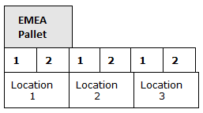
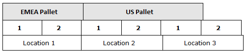

# Level Types

A level type is a configuration that allows a group of consecutive locations on a level within a bay to be considered as a single entity for storage capacity calculation. The primary purpose of a level type is to provide greater control of the capacity of an entire level by maximizing the available physical space for storage and not relying solely on whether inventory can fit into a single location. This is useful, for example, in warehouses that store inventory on different size pallets and that want to store this inventory wherever there is physical space available regardless of whether individual location capacities are exceeded. When you create a level type, you define the follow attributes:

-   **Level units**: A user-defined measurement unit in width used to calculate capacity for a level. See [Level units](#Level_units).
-   **Horizontal alignment**: Determines whether the pallets of inventory deposited on a level type must all have identical level unit values.
-   **Vertical alignment**: Determines whether pallets of inventory deposited above and below a level type must have the same level units as the pallets on that level type.
-   **Maximum weight**: Maximum amount of weight allowed to be stored on the level.

Additionally, after the level type attributes are defined, you assign a range of locations (consecutive locations on a level) to the level type. The application then calculates capacity for those locations based on the following level unit attributes:

-   Level unit configurations for the level type
-   Level units of the pallet-equivalent UOM on the item footprint for the inventory to be stored on the level
-   Level units of the handling unit type for the inventory to be stored on the level

## Level units

A level unit is a user-defined measurement in width that is used to calculate the capacity for a level of consecutive locations in a bay as a single entity instead of using individual location capacities. Level units provide width restrictions in order to properly store pallets of inventory that may span multiple locations on a level. This is useful, for example, in warehouses that store different size pallets and that want to store pallet LPNs wherever there is physical space available regardless of whether individual location capacities are exceeded.

Level units give you greater control of the capacity of an entire level by maximizing the available physical space and not relying solely on whether inventory can fit into a single location. They also work independently of the location capacity code. Locations assigned to a level type do not have strict boundaries to the left and right. Therefore, a pallet could overflow to the next location, blurring the idea of capacity for an individual location.

**Note**: For the application to successfully process level management storage, the location positions and location storage sequence should be aligned. For example, if a level has four locations with positions in order of 1, 2, 3, and 4, then the storage sequence for the locations should also be in order of 1, 2, 3, and 4.

A value for level unit is assigned to the pallet-equivalent UOM on item footprints and to pallet-level handling unit types. The value for level units that you assign to a level type (range of locations on the same level) is relative to the number of locations and the number of pallets that can be stored on the level. The number of level units for a level type must be equally distributed among the locations assigned to the type. Additionally, each location under level management should have the same number of level units as the smallest pallet-equivalent UOM or pallet-level handling unit type that can be stored on the level.

**Note**: In a warehouse that tracks handling units, the application considers the level units assigned to the pallet-level handling unit type being stored. If handling units aren't tracked, the application considers the level units assigned to the pallet-equivalent UOM on the footprint of the item being stored.

For example, assume that your warehouse tracks handling units. If you configure the EMEA pallet handling unit type as 2 level units, then each location on a level should also be 2 level units in width. To facilitate this, the number of level units defined for a level when divided by the number of locations assigned to that level should equal 2. If a level contains 3 locations, and each location fits an EMEA pallet (defined as 2 level units), then you would define the level type as having 6 level units (6 / 3 = 2). In this example, you would not be able to specify the level type as having 7 level units because it is not equally divisible by the number of locations (3).

By storing inventory on levels managed by level unit capacity, the application allows pallets to overflow to adjacent locations based on the number of level units that are occupied by the inventory. On levels that are not under level unit management, a pallet would not be allowed to take up space in two locations. However, under level management, the application considers the entire capacity of the level instead of the individual location measurements. As long as the available level units for a level is greater than or equal to the level unit value assigned to the pallet-equivalent UOM or handling unit type, the inventory can be stored on the level (assuming no other storage or level type restrictions are violated).

## Example: Level units

Assume that a warehouse tracks handling units and stores both US pallets and EMEA pallets, which typically have smaller dimensions than US pallets, and that a particular level can fit 3 EMEA pallets or 2 US pallets. Also, assume the following configuration information:

-   An EMEA pallet (handling unit type) is configured with a value of 2 level units and is the smallest pallet-level handling unit type
    
    **Note**: Because the smallest pallet-level handling unit type is configured as 2 level units, each location that stores the handling unit should also be 2 level units, or the width of a single EMEA pallet.
    
-   A US pallet is configured as 3 level units
-   The level type is assigned 3 consecutive locations on the same level (3 locations because the level can fit 3 EMEA pallets, one location for each pallet width)
-   The level type is configured with a capacity of 6 level units (3 locations x 2 level units = 6 total level units for the level)
-   The pallets being deposited do not violate the maximum weight or the horizontal and vertical alignment configurations defined for the level type

The following example shows the level split into 3 locations, with each location being 2 level units. When an EMEA pallet is deposited to the level, it consumes 2 of the available 6 level units (and occupies all of Location 1). Any pallet-level handling unit that is equal to or less than the remaining 4 level units can be stored on this level.

When a US pallet (3 level units) is deposited to the level, it occupies 2 level units from Location 2 and 1 level unit from Location 3, leaving only a single level unit of available capacity. In this example, the application would not direct any additional pallets to this level because the smallest pallet-level handling unit (EMEA pallet) is 2 level units, which is greater than the level's remaining capacity.

If these locations were not under level management, the application would only direct EMEA pallets to be stored on this level because a single US pallet exceeds a single location's width capacity. However, by placing the locations under level management, the application considers the level's capacity based on the number of available units (instead of the traditional capacity method of considering each location separately).

## Level types setup

You must perform the following tasks to set up level types in order for the application to calculate capacity by level units:

1.  Configure a level type. See [Add or modify a level type](#Add_or_modify_a_level_type).
2.  Define the level units for the pallet-equivalent UOM on the footprint of the items to be stored in locations assigned to a level type. See [Add or modify an item](../../inventory/items/items.md).
3.  Define the level units for the pallet-level handling unit types used to store inventory in locations assigned to a level type. See [Add or modify a handling unit type](../../inventory/lpn-handling/handling-unit-types.md).

**Note**: In a warehouse that tracks handling units, the application considers the level units assigned to the pallet-level handling unit type being stored. If handling units are not tracked, the application considers the level units assigned to the pallet-equivalent UOM on the footprint of the item being stored.

## Add or modify a level type

1.  Select **Configuration > Warehouse > Locations > Level Types**.
2.  Perform one of the following tasks:
    -   To add a level type, click **Add**.
    -   To modify a level type, in the grid, click the level type.
    -   To copy a level type, in the grid, select the check box next to the level type, and click **Copy**.
3.  Enter information in the [Level Types fields](#Level_Types_fields).
4.  Click **Save**.
5.  To define the location assignments for the level type:
    
    **Note**: When you assign locations to a level type, you do not select individual locations. Instead, you select an aisle, bay, and level combination that represents a range of consecutive locations. Each range of locations that you select is considered a single entity for storage capacity calculation based on the level type.
    
    1.  Under **LOCATIONS**, click **Location Assignments**.
    2.  To assign locations:
        1.  Click **Add**. The Available Locations page is displayed.
        2.  In the grid, select the check box next to the aisle-bay-level combinations to assign to the level type.
            
            **Note**: Locations assigned to a level type should only store pallets. Additionally, the capacity code for level type locations should be set to Length or Pallet.
            
        3.  Click **Save**. The Assigned Locations page is displayed.
    3.  To delete location assignments:
        1.  In the grid, select the check box next to the aisle-bay-level combinations to remove from the level type.
        2.  Click **Delete**.
        3.  Click **OK**, and then click **Save**.

## Level Types fields

 
| Field | Description |
| --- | --- |
| Name | Name of the level type. A level type is a configuration that allows a group of consecutive locations on a level within a bay to be considered as a single entity for storage capacity calculation. A level type (name) is unique to a specific group of consecutive locations on the same level and is not reused on other levels or location groups. |
| Description | Text that further describes the level type. |
| Maximum Weight Validation | If Yes, the application prevents the deposit of inventory that would cause the total weight on the level to exceed the value defined by the **Maximum Weight** field.  If No, the application does not perform weight validation for the level. |
| Maximum Weight | Maximum weight of inventory that can be stored on the level type. This amount is the collective maximum weight allowed for all the locations assigned to the level type; however, individual location weight capacities are also respected.  To change a measurement unit, click the unit next to the field, and select a different unit.  The **Maximum Weight** field is only available if the **Maximum Weight Validation** field is set to Yes. |
| Total Level Units | Number of level units (width) for the level type (all assigned locations on the level). The number of total level units must be a multiple of the level units assigned to the smallest pallet-level handling unit type (if the warehouse tracks handling units) or pallet-equivalent UOM on a footprint that can be stored on the level.  This is so that each location has the same number of level units (each location on the level should be the width of the smallest pallet-level handling unit or smallest pallet-equivalent UOM). For example, if a level can fit 5 of the smallest pallet-level handling unit (5 locations), the total number of level units for the level needs to be 5, 10, or 15 and so on. If you enter 10, then each location is made up of 2 level units, and the level unit value for the handling unit type should also be 2. If the same level can fit 3 larger pallets, then the level unit value for the larger pallet-level handling unit type should be 3 (3 level units x 3 pallets = 9 total level units; this means the level has reached capacity since there are not enough available level units to store the smallest pallet size of 2 level units). See [Level units](#Level_units) and [Example: Level units](#Example:_Level_units). |
| Enforce Vertical Alignment | If Yes, then in order for a pallet to be deposited to this level type, the level units assigned to the pallet-equivalent UOM or pallet-level handling unit must match the level units of the pallets that are located in the same position on levels above or below this level. For example, if vertical alignment is enforced for Level 1 and Level 2, and Level 1 contains a pallet-level handling unit of 3 level units, then the application only allows other pallets of 3 level units to be stored on Level 2.  **Note**: This is only enforced when the locations above or below are also assigned to a level type. If the locations above or below are not assigned to a level type, then they are not considered when the application enforces vertical alignment.  If No, then the application does not enforce vertical alignment and pallets of any level unit value can be deposited above and below this level. |
| Enforce Horizontal Alignment | If Yes, then all pallets that are deposited to this level type must have the same level unit value to retain horizontal consistency. For example, if a pallet-level handling unit that is assigned 2 level units is deposited to this level type, then only other pallets of 2 level units can be deposited to the level. Select Yes, for example, to ensure that only one pallet size can occupy the level type at one time. This can maximize the level's storage space for a single-size pallet, but reduce available space for pallets of a different size. For example, if a level has 6 total level units and a pallet of 2 level units is deposited, with horizontal enforcement, you are ensuring that 2 additional pallets of that size can be stored on the level (3 pallets total or 6 level units) instead of depositing one larger pallet, such as one defined with 3 level units (2 pallets total or 5 level units, leaving 1 level unit of unoccupied space).  If No, then the application does not enforce horizontal alignment, and pallets with different level unit values can be stored together on this level type. |
| Display Pending Inventory Indicator | If Yes, then during deposit, RF operators can access the Pending Inventory on Level display to view inventory that is pending deposit to locations on the level. The display shows the footprint or handling unit information for the pending pallets. An asterisk is displayed on the RF deposit screen if the current location was overflowed from a previous location by pending inventory. If this occurs, RF operators can access the display to determine how far to offset the current deposit to allow for pending inventory. This option useful for horizontal location positions.  If No, then during deposit, RF operators cannot access the Pending Inventory on Level display. |

Supply Chain Execution Web Applications 2022.1.0.0 Help | Last updated: 31 May 2024

© 2014-2024 Blue Yonder Group, Inc. All rights reserved. [Legal notice](https://bf56-kms-wms-web-np2.jdadelivers.com/web/help/content/legal_notice.htm)

Contact: [Customer Support](https://success.blueyonder.com/ "Blue Yonder Customer Support") | [Services](https://blueyonder.com/services "Blue Yonder Services")
