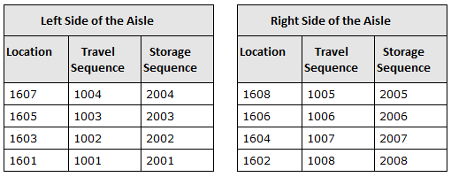
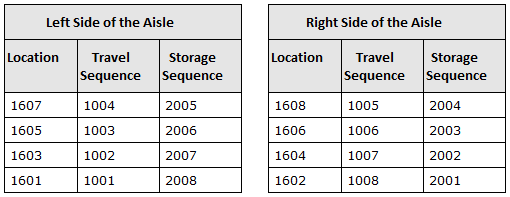
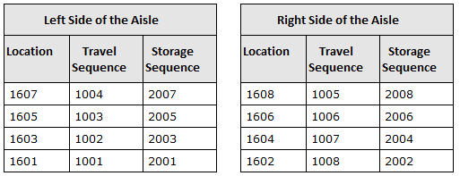

# Location Sequences

A location sequence is a configuration that defines the travel sequence in which the application should direct an operator to perform directed work. When a travel sequence is defined for a location, you can configure the sequence in which the application should search for a storage location to deposit inventory within a storage zone.

## Travel sequence

Travel sequence is a numeric value assigned to a location. The application uses this value to arrange candidate locations for directed work (such as picking) in sequential order. For example, you can assign travel sequence (in sequential order) to locations down one side of an aisle and back up the opposite side of the aisle to direct picking in that order.

The application applies travel sequence in order, from the lowest number (1 being the lowest) to the highest.

The following processes can also be configured to use the travel sequence configuration:

-   Pick order for a work assignment. See [Work assignment rules](../../outbound/picking/work-assignments.md).
-   Order in which the application assigns an available resource location during pick release. See [Configure pick release attributes](../../outbound/picking/pick-release.md).
-   Bulk picking deposit process. See [Bulk picking deposit](../../outbound/picking/bulk-picking.md).
-   Sequence in which LPNs are displayed to an RF operator for deposit when moving multiple LPNs at the same time. See [Configure storage settings](../../inbound/storage/storage-settings.md).

## Storage sequences

Storage sequence defines the order in which the application selects a location to deposit inventory within a storage zone. Storage sequence can be assigned to individual locations (using the storage location configuration) or to a range of locations (using the storage sequence configuration).

A storage sequence can only be assigned to a location that has a travel sequence assigned. This is because the storage sequence uses the travel sequence to determine whether a location is in a range. For example, if locations are numbered from 1601 to 1608, but travel sequence specifies that location 1601 is first and location 1602 is last, then a storage sequence with a starting location of 1601 and an ending location of 1602 includes all 8 locations. See [Example: Storage sequence follows travel sequence](#Example:_Storage_sequence_follows_travel_sequence).

You use storage sequence, for example, to fill locations in a storage zone in the same sequence as the travel sequence, in the reverse sequence of travel sequence, or by alternating between locations on right and left sides of an aisle.

**Note**: Storage sequence is overridden if the storage zone is configured to direct inventory to the last location. If the **Last Location** field is set to Yes on the storage zone, the application directs an item to the last location that was used for storing the item until that location is full, and then it returns to using the storage sequence.

## Example: Storage sequence follows travel sequence

For an aisle storage area, you can direct an operator to fill storage locations in the same sequence as the travel sequence. For this example, travel sequence directs an operator down the left side of the aisle before turning around and moving back up the right side of the aisle.

To set the storage sequence for this example, use the following values:

-   **Start Location**: Enter the location at which the storage sequence starts; for example: 1601.
-   **End Location**: Enter the location at which the storage sequence ends; for example: 1602.
-   **Start Sequence**: Enter the storage sequence number to assign to the start location; for example: 2001.
-   **Increment By**: Enter 1, to increment the sequence number by one for each location in the travel sequence range. The resulting storage sequences would be from 2001 to 2008 assigned to locations in the same order as the travel sequence.

The following tables illustrate the two sides of the aisle in this example.

## Example: Storage sequence is reverse of travel sequence

For an aisle storage area, you can direct an operator to fill storage locations in the reverse order of travel sequence. For this example, travel sequence directs an operator down the left side of the aisle before turning around and moving back up the right side of the aisle.

To set the storage sequence for this example, use the following values:

-   **Start Location**: Enter the location at which the storage sequence starts on the left side of the aisle; for example: 1601.
-   **End Location**: Enter the location at which the storage sequence ends on the right side of the aisle; for example: 1602.
-   Select the **Reverse Location** check box.
-   **Start Sequence**: Enter the sequence number to assign to the start location; for example: 2001.
-   **Increment By**: Enter 1, to increment the sequence number by one for each location in the travel sequence range. In this example, the resulting storage sequences would be from 2001 to 2008 assigned to locations in reverse order of the travel sequence.

The following tables illustrate the two sides of the aisle in this example.

## Example: Storage sequence alternates between sides of the aisle

For an aisle storage area, you can direct an operator to fill storage locations by alternating between locations on the left and right sides of the aisle. For this example, travel sequence directs an operator down the left side of the aisle before turning around and moving back up the right side of the aisle.

To set the storage sequence for this example, use the following values:

-   Create a storage sequence configuration for the left side of the aisle:
    -   **Start Location**: Enter the location at which the storage sequence starts on the left side of the aisle; for example: 1601.
    -   **End Location**: Enter the location at which the storage sequence ends on the left side of the aisle; for example: 1607.
    -   **Start Sequence**: Enter the sequence number to assign to the start location; for example: 2001.
    -   **Increment By**: Enter 2, to increment the sequence number by two for each location in the range. In this example, the resulting storage sequences would be 2001, 2003, 2005, and 2007.
-   Create a storage sequence configuration for the right side of the aisle:
    -   **Start Location**: Enter the location at which the storage sequence starts on the right side of the aisle; for example: 1602.
    -   **End Location**: Enter the location at which the storage sequence ends on the right side of the aisle; for example: 1608.
    -   **Start Sequence**: Enter the sequence number to assign to the start location; for example: 2002.
    -   **Increment By**: Enter 2, to increment the sequence number by two for each location in the travel sequence range. In this example, the resulting storage sequences would be 2002, 2004, 2006, and 2008.

The following tables illustrate the two sides of the aisle in this example.

## Configure travel sequences

For each location, you can define the sequence in which the application should direct an operator to perform directed work, such as picking.

1.  Select **Configuration > Warehouse > Locations > Location Sequences**.
2.  Above the grid, select **Travel**.
3.  To define a travel sequence:
    1.  From the **Actions** drop-down list, select **Set Sequence**.
    2.  Enter information in the [Set Sequence fields](#Set_Sequence_fields).
    3.  Click **Save**.
4.  To delete a travel sequence:
    1.  In the grid, select the check box next to the location.
    2.  From the **Actions** drop-down list, select **Remove Sequence**. A confirmation message is displayed.
    3.  Click **OK**.

## Configure storage sequences

For each location, you can define the sequence in which the application should search for a storage location. When you select a range of locations, a location will only display if it has a travel sequence defined.

1.  Select **Configuration > Warehouse > Locations > Location Sequences**.
2.  Above the grid, select **Storage**.
3.  To define a storage sequence:
    1.  From the **Actions** drop-down list, select **Set Sequence**.
    2.  Enter information in the [Set Sequence fields](#Set_Sequence_fields).
        
        **Note**: The travel sequence is displayed below the **Start Location** and **End Location** fields. When you select a range of locations, the storage sequence is only assigned to locations that have a travel sequence defined.
        
    3.  Click **Save**.
4.  To delete a storage sequence:
    1.  In the grid, select the check box next to the location.
    2.  From the **Actions** drop-down list, select **Remove Sequence**. A confirmation message is displayed.
    3.  Click **OK**.

## Set Sequence fields

 
| Field | Description |
| --- | --- |
| Start Location | First location in the range of locations to which a sequence is assigned. |
| End Location | Last location in the range of locations to which a sequence is assigned. |
| Reverse Location | Indicates that the range of locations is reversed before the sequences are assigned. For example, if the start location is 1CASE100 and the end location is 1CASE150, the range of sequences are assigned starting with 1CASE150 and incrementally assigned to each location through 1CASE100. |
| Start Sequence | Value for the sequence to assign to the first location in the range. |
| Increment By | Value by which to increment each sequence to obtain the sequence for the next location in the range. |

Supply Chain Execution Web Applications 2022.1.0.0 Help | Last updated: 31 May 2024

© 2014-2024 Blue Yonder Group, Inc. All rights reserved. [Legal notice](https://bf56-kms-wms-web-np2.jdadelivers.com/web/help/content/legal_notice.htm)

Contact: [Customer Support](https://success.blueyonder.com/ "Blue Yonder Customer Support") | [Services](https://blueyonder.com/services "Blue Yonder Services")
