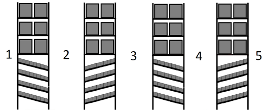

# Location Types

A location type is used to configure and group locations that are used for similar purposes, regardless of their proximity to one another. Every location must be assigned to a location type. Location type attributes define how the application tracks and processes inventory or transport equipment in the location. A location inherits the attributes defined for the location type to which it is assigned.

Physical location types are used to configure locations that represent an actual physical space. Logical location types are used to configure locations that the application uses to track inventory in transit or outside the facility.

The following table lists the attributes (fields) that are required for some common location types. You can add and configure the locations types required for your facility. After location types are defined, you can add locations to each type.

  
| Location type | Purpose | Required attributes |
| --- | --- | --- |
| Distribution | Used for either unplanned inventory, or for planned inventory that is intended for a specific customer. All of the planned inventory in a distribution location is part of an active shipment and ships together on the same transport equipment. | **Distribution Processing** (for planned inventory)  **Four Wall Inventory**  **Distribute to Storage** (for unplanned inventory) |
| Dock Doors | For receiving, used for locations where inbound orders are unloaded from transport equipment and received into the facility  For shipping, used for locations where outbound orders are loaded onto transport equipment for shipping  For shipping and receiving, used for locations where inbound and outbound orders are unloaded from or loaded to transport equipment | **Four Wall Inventory**  **Receiving Dock**, **Shipping Dock**, or both |
| Pickup and Deposit | Used for locations in which an operator can deposit an entire multi-destination LPN and with one scan confirm that the mixed LPN was deposited. The operator does not have to scan each individual LPN. | **Four Wall Inventory**  **Pickup and Deposit** |
| Processing | Used for special handling or manipulation of inventory as it is moved through the facility, such as at a packing station or location where cases are consolidated on pallets for shipping | **Four Wall Inventory**  **Processing** |
| Production | Used to produce finished items for a work order. This location type is typically configured to be outside the four walls of a facility so that inventory delivered to the production line is immediately consumed and is no longer available.  Used as staging locations for production lines and production stations | **Production Line Staging**  **Work in Process** |
| Staging | For receiving, used to temporarily store inventory that is being unloaded from inbound transport equipment so that it can be received into the facility before being moved to its appropriate storage location  For shipping, used for combining and preparing inventory to be shipped  For receiving and shipping, used for staging both inbound and outbound shipments | **Four Wall Inventory**  **Processing**  **Receiving Staging**, **Ship Staging**, or both  **Track Capacity** |
| Storage | Used to store inventory. These locations are typically configured to support picking a unit of measure, such as pallets, cases, or eaches. | **Four Wall Inventory**  **Track Capacity**  **Storage** |
| Yard | Used for locations that are outside the facility where transport equipment is parked or stationed prior to being moved to a dock door for unloading or loading | **Yard** |

## Location type categories

A location type is used to define a group of locations that share similar attributes and functions, regardless of their proximity to one another. A location inherits the attributes defined for the location type to which it is assigned. Every location must be associated with a location type.

The following list describes the categories of location types. A category determines how the location is used and which attributes must be defined for the location type.

-   **Dock Doors**
    -   **Receiving**: Used for locations where inbound orders are unloaded from transport equipment and received into the facility.
    -   **Shipping**: Used for locations where outbound orders are loaded onto transport equipment for shipping.
    -   **Shipping & Receiving**: Used for locations where inbound and outbound orders are unloaded from or loaded onto transport equipment.
-   **Pickup and Deposit**
    
    Used for locations in which an operator can deposit an entire multi-destination LPN and with one scan confirm that the mixed LPN was deposited, instead of having to scan each small LPN.
    
-   **Processing**
    
    Used for special handling or manipulation of inventory as it is moved through the facility. For example, if your facility is configured to direct all eaches (or pieces) that have been reserved for an order to a packing location to be placed in cartons, then the location type used for packing locations must be enabled as a processing area. Locations of this type can also be locations in which individual cases are consolidated on a pallet for shipping.
    
-   **Production**
    -   **Production Line**: Used to produce finished items for a work order. This location type is used for production stations that are configured to be work in process locations. These locations are also configured to be outside the four walls of a facility so that any component item delivered to the location is immediately consumed and is no longer available for allocation. This location type is also used for work in process supply areas.
-   **Staging**
    -   **Cross Docking**: Used for indirect cross docking. When inventory that is marked for cross docking is received, it can be moved to locations of this type before being moved to a ship staging location. Locations of this type are also used for performing a value-added service (such as special labeling or packaging) on the received inventory before it is shipped.
    -   **Production Staging**: Used for staging inventory for production lines and production stations, so that it can be used in work order processing.
    -   **Receiving Staging**: Used to temporarily store inventory that is being unloaded from inbound transport equipment so that it can be received into the facility before being moved to its appropriate storage location.
    -   **Shipping & Receiving Staging**: Used for staging both inbound and outbound orders.
    -   **Shipping Staging**: Used for combining and preparing inventory to be shipped. Typically, inventory that is reserved for orders must be deposited in a ship staging location before the inventory can be loaded on transport equipment, unless fluid loading has been enabled. If this option is enabled, then the application automatically enables the location type as a processing area.
-   **Storage**
    -   **Storage**: Used to store inventory. If inventory is moved from a non-storage location to a storage location and it is not work order inventory, then the application will prompt the operator to perform workflows on the inventory, if configured workflows apply.
    -   **Distributed to Storage**: Used for inventory that is destined to a specific customer, but the outbound shipment for the material has not been planned and released for picking and shipping.
-   **Yard**
    
    Used for storing and moving transport equipment from the yard to dock doors and from dock doors back to the yard prior to dispatching the equipment.
    

## Physical locations

A physical location is an actual physical space within or associated with a building. Physical locations are typically defined within a warehouse can be configured to support one or more of the following processes:

-   **Storage**: Locations, such as the following, are used to store and provide pick locations for inventory:
    -   Full pallet or bulk storage, where inventory is stored and picked as full pallets
    -   A case storage location that occupies the top shelf of a rack storage system
    -   A case pickface location where cases of inventory are picked directly from the racks or shelves in which they are stored
-   **Temporary storage**: Locations, such as the following, are used as temporary sites for inventory that is being moved through the facility:
    -   A pickup and deposit (P&D) location at the end of an aisle of rack storage. Vehicles used to pick inventory from the racks deposit the inventory in the P&D location, allowing a fork truck driver to move it to ship staging.
    -   A shipment staging location near the dock where picked inventory can be prepared for shipping
-   **Processing**: Locations, such as the following, are used to process or perform special handling on inventory:
    -   A work order location to which inventory is deposited for such processes as assembly, tagging, or customization
    -   A packing location to which inventory is deposited to be packed into cartons for shipping
    -   A consolidation location to which cases of inventory are deposited to be combined with other cases on a pallet for shipping
-   **Docks and yards**: Locations, such as the following, are used for docks and locations in the yard that support shipping and receiving operations:
    -   Yard locations where transport equipment is parked prior to being loaded or unloaded
    -   Dock doors where transport equipment is parked for loading and unloading

## Logical locations

A logical location is a location that does not physically exist, but is used by the application for tracking purposes (such as to display inventory that does not currently reside in the facility) or to perform processes. Logical locations are defined in the application prior to implementation.

**IMPORTANT**: Do not adjust the attributes of logical location types unless authorized to do so. Misconfiguration of logical location types can prevent certain processing from taking place.

The application uses logical locations to support the following processes:

-   **Inventory adjustments and damage**: Locations, such as the following, are used to communicate inventory changes to a host:
    -   An inventory adjustments location to which the application logically moves inventory that has been lost or found. When the application moves inventory into this location, with a positive quantity for found inventory and a negative quantity for lost inventory, an automatic notification is sent to the host indicating the change in the quantity of available inventory.
    -   A scrap location to which the application logically moves inventory that is not usable; for example, because it is damaged or does not meet quality standards. A move to this location also initiates an automatic notification to the host of the change in the quantity of available inventory, but might provide a different reason for the change.
-   **Inventory tracking**: Locations, such as the following, are used to provide a view of inventory that does not physically reside in the facility:
    -   An expected receipts location to which the application logically moves inventory that has been identified but has not yet been placed into a storage location. The inventory may be physically located on the transport equipment or at the dock, but until it is placed into storage, the application tracks it as being in the expected receipts location.
    -   A shipment location in which information about inventory on a shipment that has already been shipped can be viewed. The application moves inventory information to the logical shipments location after a shipment is closed.
-   **Shipment and dispatch**: Locations, such as the following, are used to provide a view of inventory that has been loaded onto shipping transport equipment:
    -   A shipment location that is designated as four-wall inventory, so that the shipment inventory can be included in inventory summaries sent to the host.
    -   A dispatch location to which the application logically moves inventory from a shipment after the transport equipment has been dispatched. A dispatch location cannot be designated as four-wall inventory, so its inventory is not included in inventory summaries sent to the host.

## Backfill locations

A backfill location is a warehouse location that can be accessed from two separate physical aisles with different coordinates. The back of the location in one aisle is used to deposit or replenish inventory to the location, and the front of the location in the second aisle is used for picking inventory from or counting inventory in the location. For example, consider a case flow rack location accessible from Aisle 1 (back) and Aisle 2 (front). When the location needs to be replenished or inventory is stored in the location, the application directs the operator to Aisle 1; and when cases need to be picked from the location, the application directs the operator to Aisle 2.

The following image is an example of storage locations configured as backfill locations. There are four levels of flow rack storage locations beneath three levels of pallet storage locations. Each flow rack location is accessible from two aisles, with aisles 1, 3, and 5 meant for replenishing the backfill locations, and aisles 2 and 4 meant for picking from the front of the flow rack locations.

When Warehouse Management is integrated with Warehouse Labor Management, you can configure backfill locations so the labor standards used for discrete distances and travel sequence are accurate and dependent on the operation being performed. For example, the distance an operator must travel to reach the back of a backfill location may be farther than traveling to the front of the same location, so the application determines which operation is being performed and uses the appropriate location coordinates for labor calculations. Additionally, if directed work by proximity is enabled, the application considers the coordinates for both the front and back of a location before assigning the work with the closest proximity.

Locations in Warehouse Management that are configured as backfill locations, and therefore have associated backfill location names, are still considered a single location with the backfill location name serving as an alternate identifier. Based on the operation, the application expects the operator to scan a specific identifier for the location. When picking, operators must scan the front of the location, which is also the master location identifier. When depositing or replenishing inventory, operators must scan the back of the location, which is the alternate ID assigned as the backfill location name. If the operator scans the wrong identifier, a message is displayed indicating the incorrect side (front or back) of the location was scanned. The backfill location name can also be used as search criteria on the Inventory page and the Work Queue page.

**Note**: If a location associated with a backfill location is set out of service or is in error, the backfill location has the same status as the main (front) location.

### Setup 

In an integrated instance of Warehouse Management and Warehouse Labor Management, you must perform the following tasks in the SCE client to use backfill locations: 

1.  Create a bay type for front locations and a bay type for back locations using Bay Type Maintenance.
    -   For front location bay types, from the **Fill Type** drop-down list, select **Front**. Setting the **Fill Type** field to Front indicates that the bay represents the front side of the backfill location, where tasks such as picking and counting take place.
    -   For back location bay types, from the **Fill Type** drop-down list, select **Back**.
2.  Create front locations using Logical Aisle Maintenance.
    1.  Add a logical aisle.
    2.  Select a side of the aisle and create a bay.
    3.  Assign the front location bay type to the bay and save the locations.
3.  Create back locations using Logical Aisle Maintenance.
    1.  Add a logical aisle.
    2.  Select a side of the aisle and create a bay.
    3.  Assign the back location bay type to the bay and save the locations.
4.  If locations are created in Warehouse Labor Management in a backfill bay type position, then modify individual locations in Warehouse Management to assign each location a backfill location name and, if required, a backfill verification code. See [Modify a storage location](storage-locations.md).
    
    **Note**: Locations created in a bay type position with the **Fill Type** set to Front are synced with and created in Warehouse Management, if configured. However, since backfill locations are considered alternate identifiers for a master location in Warehouse Management, backfill locations are not created and must be associated to their master location manually in Warehouse Management.
    

In a standalone instance of Warehouse Management, you must perform the following tasks to use backfill locations:

**Note**: You do not need to perform these configuration steps in integrated instances of Warehouse Management and Warehouse Labor Management.

1.  Configure backfill location types (**Backfill Location** field set to Yes for a location type). See [Add or modify a location type](#Add_or_modify_a_location_type).  
2.  Create storage locations of the backfill location type by performing the following tasks:
    -   Create a range of storage locations with an associated range of backfill locations. See [Add storage areas and locations](storage-locations.md).
        
        **Note**: When you configure new pick locations with backfill location in an aisle, the locations on the right and left side of the aisle should be added separately. This is because the locations on the left side of the aisle will have backfill locations in a different aisle than the backfill locations associated with the pick locations on the right side of the aisle. For example, if Aisle 2 is the picking aisle, then the backfill locations for the left side of Aisle 2 will be in Aisle 1, and the backfill locations for the right side of Aisle 2 will be in Aisle 3.
        
    -   Modify individual locations to assign each location a backfill location name and, if required, a backfill verification code. See [Modify a storage location](storage-locations.md).
        
        **Note**: You cannot perform mass updates on backfill locations; each backfill location must be updated separately.
        

## Location type consolidation

You can use the Consolidate action, available from the location types grid, to consolidate location types that share a common configuration into a single (original) location type. See [Consolidate location types](#Consolidate_location_types).

When you select a location type and use the Consolidate action, the application presents a list of location types that have a configuration that matches the selected (original) location type. You can then select one or more of the matching location types to consolidate to the original location type.

During consolidation, the application performs the following tasks:

-   Updates all the configurations and references for the location types that are being consolidated to now use the original location type. For example, if LocType2 and LocType3 were consolidated into LocType1, then the locations based on LocType2 and LocType3 are updated to use LocType1.
-   Removes the consolidated location types and retains the original location type.
-   Displays a progress bar that shows the processing status of the consolidation.
-   When consolidation is complete, displays the list of any remaining consolidation candidates that match the original location type. This allows you to continue consolidating to the original location type.

The same process is available for zones using any zone configuration. See [Zone consolidation](../../outbound/allocation/pick-zones.md).

## Add or modify a location type

1.  Select **Configuration > Warehouse > Locations > Location Types**.
2.  Perform one of the following tasks:
    -   To add a location type:
        1.  From the **Actions** drop-down list, select **Add**.
        2.  Enter information in the following fields:
            
            | Field | Description |
            | --- | --- |
            | Category | Category that defines how the location type is used. |
            | Sub-Category | Sub-category that defines how the location type is used. This field is only available if the category requires a sub-category. |
            
        
        **Note**: When adding a new location type, only the fields that pertain to the selected category and sub-category are displayed.
        
    -   To modify a location type, in the grid, click the location type.
3.  Enter information in the [Location Types fields](#Location_Types_fields).
4.  Click **Save**.

## Delete a location type

You cannot delete a location type that is assigned to a location.

1.  Select **Configuration > Warehouse > Locations > Location Types**.
2.  In the grid, select the check box next to the location type.
3.  From the **Actions** drop-down list, select **Delete**. A confirmation message is displayed.
4.  Click **Yes**.

## Consolidate location types

You use the following procedure to consolidate location types that have the same configurations into a single (original) location type. See [Location type consolidation](#Location_type_consolidation).

1.  Select **Configuration > Warehouse > Locations > Location Types**.
2.  In the grid, select the location type to which duplicate location types will be consolidated. This becomes the original location type that remains after the duplicate location types have been removed. This is also the location type to which references and configurations are updated.
3.  From the **Actions** drop-down list, select **Consolidate**. A list of location types that have the same configuration as the original location type are displayed.
4.  In the grid, select the check box next to the location types to consolidate. The selected location types will be removed after consolidation takes place.
5.  Click **Save**. The selected location types are removed, and the Consolidation page displays the remaining location types, if any, that match the original location type.

## Location Types fields

 
| Field | Description |
| --- | --- |
| Location Type Name | Name for the location type. A location type is a category that is used to group and configure locations that are used for similar purposes, regardless of their proximity to one another. Location type attributes define how the application tracks and processes inventory or transport equipment in the location. |
| Description | Text that further describes the location type. |
| Track Capacity | If Yes, the application tracks the capacity of locations of this type when inventory is deposited to the location. Capacity is tracked to prevent the deposit of too much inventory, and to initiate replenishments based on defined thresholds. Select Yes if the location type is used for inventory storage or has limited capacity.  If No, the application does not track the capacity of locations of this type. Select No, for example, for ship staging locations in which you allow operators to deposit as much inventory as is needed for a shipment and are not concerned with the quantities in the location. If you select No, the application does not track capacity in the location and the location status is always Empty. |
| Pickup and Deposit | If Yes, locations of this type are used as a temporary holding place for inventory. The following examples represent pickup and deposit (P&D) locations: -   • Locations to which partial pallets picked for a work assignment can be deposited when an exception occurs or when there are remaining picks to be completed by an operator in the next work zone
 -   • Ship staging locations are P&D because picked inventory is deposited temporarily until it is loaded onto transport equipment
 -   • A location, for example, at the end of an aisle of rack storage can be designated as P&D; this allows vehicles used for picking from the racks to deposit inventory in the location so that a fork truck driver can move it to ship staging
  If No, locations of this type are not temporary holding places for inventory deposits. |
| Inventory Mixing | If Yes, then when an operator moves inventory to or within a location of this type, the application validates that LPN-level mixing restrictions are not violated by the deposit. For example, if LPN-level mixing restrictions for non-picked inventory prevent mixing item families, then if the operator attempts to transfer a case to an LPN in a storage location that contains a different item family, the application does not allow the deposit. As another example, if the LPN-level mixing restrictions for picked inventory prevent mixing shipments, then if the operator attempts to deposit picked inventory to a staging location that already contains inventory for another shipment, the application does not allow the deposit.  **Note**: The LPN-level mixing restrictions that are applied depend on the type of inventory being deposited.  If No, then the application does not validate LPN-level mixing restrictions when inventory is moved to or withing a location of this type. However, in pickable storage locations, inventory must still satisfy applicable mixing restrictions defined for the storage zone, building, or warehouse. |
| Backfill Location | If Yes, locations of this type are considered backfill locations. A backfill location is a warehouse location that can be accessed from two separate physical aisles with different coordinates. The back of the location in one aisle is used to deposit or replenish inventory to the location, and the front of the location in the second aisle is used for picking inventory from or counting inventory in the location. You assign a unique backfill location name that serves as an alternate identifier when an operator confirms a backfill location during a deposit or replenishment. See [Backfill locations](#Backfill_locations).  If No, then locations of this type are not backfill locations that can be accessed from two aisles. |
| Receiving Staging | If Yes, locations of this type are used to temporarily store inventory that is being unloaded from inbound transport equipment so that it can be identified and received into the facility before being moved to its appropriate storage location.  If No, locations of this type are not used for temporary storage of inventory unloaded from inbound transport equipment. |
| Receiving Dock | If Yes, locations of this type are dock doors where inbound shipments are unloaded from transport equipment and received into the facility. Dock door locations can configured as both receiving dock and shipping dock location types to support unloading inbound shipments and loading outbound shipments.  If No, locations of this type are not receiving dock doors. |
| Storage | If Yes, locations of this type are used to store inventory. Storage locations can be set up according to how inventory is stored and picked from the locations. For example, locations can be configured to support the following types of storage: -   • Full pallet or bulk storage locations where inventory is stored and picked as full pallets
 -   • Case storage locations from which each pickfaces are replenished
 -   • Pickface locations where cases or eaches of inventory are picked directly from the racks or shelves on which they are stored
  If No, locations of this type are not used to store inventory. |
| Four Wall Inventory | If Yes, locations of this type are used to track inventory that is physically inside the facility. The application tracks inventory in four-wall locations for the purpose of reporting on inventory levels, verifying counts, and finding inventory to allocate for orders. Typically, inventory summary information that is sent to the host includes the inventory that resides in locations designated as Four Wall Inventory.  If No, locations of this type are not used to track inventory that is physically in the facility. Select No, for example, for locations used to track planned inbound inventory (expected receipts), inventory that has been adjusted out of a location because of a count discrepancy, and inventory on transport equipment that has been dispatched from the facility. |
| Receive Without Order | If Yes, locations can be used to create inventory when receiving without order. If set to Yes, you can use the Receive Without Order window to identify inventory into the warehouse from locations of this type. This process is used, for example, to receive inventory from a production line that is managed by a host application outside of the application. Only available when the **Four Wall Inventory** field is set to No.  If No, you cannot perform Receive Without Order from locations of this type. |
| Purge Inventory Immediately | If Yes, then when inventory is moved into locations of this type, the inventory is immediately purged. As a result, the LPNs that were assigned to the purged inventory can be immediately used again. For example, if inventory is adjusted out of a four-wall location into a non-four-wall adjustment location of this type, the inventory is purged instantly. The LPNs can then be identified back into the application, with different attributes if required, from the logical adjustment location. This field is available only if the **Receive Without Order** field is set to Yes.  **Note**: This configuration to purge inventory and reuse LPNs immediately does not apply to inventory that is shipped out. This configuration is applied only when the **Adjustments** field is set to Yes.  If No, then inventory that is moved from a four wall to a non-four wall location is not purged immediately. Instead, it is purged periodically, based on the configuration of the job that purges inventory from an adjustment location. The LPNs assigned to the inventory cannot be used again until the inventory is purged. |
| Receiving Inventory Status | Inventory status that is assigned to inventory received without an order from source locations of this type, such as a location containing inventory from a production line that is managed outside of the application. For example, if you select the Available status, all inventory received without an order from source locations of this type are assigned a default status of Available. If authorized to do so, the receiving operator can change the status of inventory that was received with the default status. Only available if the **Receive Without Order** field is set to Yes. |
| Processing | If Yes, locations of this type are used for special handling or manipulation of inventory that is moved through the facility. For example, select Yes for the following types of locations: -   • Work order locations to which inventory is deposited for processes such as assembly, tagging, or customization
 -   • Packing locations to which inventory is taken to be packed into shipping cartons
 -   • Consolidation locations to which cases of inventory are consolidated with other cases on a pallet for shipping
  If **Ship Staging** is set to Yes, the application automatically sets the **Processing** field to Yes.  If No, locations of this type are not used for processing inventory. |
| Start Processing | If Yes, all of the inventory required for a process, such as packing, must be deposited to the processing location before processing may begin.  If No, processing may begin when all or a partial amount of the required inventory has been deposited to the processing location. |
| Automatically Clear Processing | If Yes, locations of this type are processing locations that the application automatically releases when processing is complete. For example, select Yes for pack station processing locations, where inventory is deposited so that it can be packed into shipping cartons. When packing is complete, the location to which inventory was deposited is automatically cleared (released), which makes it available for another deposit.  If No, locations of this type are not used for processing or, if they are, you plan to clear locations manually when processing is complete, or you do not want the locations released after they are emptied. Select No, for example, for processing locations, such as for distribution deposit, that are consistently used for recurring orders from a specific customer or for inventory belonging to a specific item family.  **Note**: If the **Ship Staging** field is set to Yes, then this configuration has no effect on whether the application automatically clears a ship staging location of this type used for a truckload (TL) shipment. For TL shipments, the application always automatically clears and releases ship staging locations after processing is complete, unless a location is configured for permanent assignment (**Assignment** field set to Yes). However, if you want to release staging locations for less-than-truckload (LTL) shipments, regardless of the **Ship Staging** field setting, then you must set the **Automatically Clear Processing** field to Yes. |
| Shipping Dock | If Yes, locations of this type are dock doors where outbound shipments are loaded onto transport equipment and shipped from the facility. Dock door locations can configured as both receiving dock and shipping dock location types to support unloading inbound shipments and loading outbound shipments.  If No, locations of this type are not shipping dock doors. |
| Ship Staging | If Yes, locations of this type are used to temporarily store picked inventory prior to loading it onto transport equipment. Typically, picked inventory for outbound orders must be deposited in a ship staging location, where it is combined with other inventory for the shipment before being loaded on transport equipment, unless fluid loading has been enabled. If **Ship Staging** is set to Yes, then the application automatically sets the **Processing** field to Yes.  If No, locations of this type are not used to temporarily store picked inventory prior to loading for shipment. |
| Allow Location Override | If Yes, in locations of this type, operators can override the application-directed location, such as a ship staging or hop location, and choose a different location when depositing inventory. For overrides to be allowed, this attribute must be set to Yes for both the original and the operator-selected deposit location, and the new location must be within the same zone as the original location. If no other locations are available within the original zone, the operator can deposit the inventory to a pickup and deposit (P&D) location until a location becomes available in the original zone.  **Note**: Operators performing distribution deposit with a voice device cannot utilize the location override functionality.  If No, in locations of this type, operators are not allowed to override the application-directed deposit location. |
| Follow-the-Leader | If Yes, then in locations of this type, if the operator overrides the ship staging location when depositing a pick, any released picks that have the same resource code as that pick are redirected to the new ship staging location. To use the follow the leader functionality, this field must be set to Yes on the location type for both the original and the new ship staging location. Select Yes if the reason for overriding a location is typically because the location is full or no longer usable.  If No, then in locations of this type, if the operator overrides the ship staging location when depositing a pick, any released picks that have the same resource code as that pick are not redirected to the new deposit location; the application directs them to the original deposit location. Select No if the reason for overriding a location is typically unique to the current pick, such as for repacking a damaged carton. |
| Yard | If Yes, locations of this type are locations outside the facility where transport equipment is parked or stationed prior to being moved to a dock door for unloading or loading. The application uses yard locations to track the location of transport equipment and to direct the move of transport equipment to and from dock doors.  If No, locations of this type are not locations outside the facility where transport equipment is parked or stationed. |
| Ship/Receipt Inventory Mixing | If Yes, locations of this type support the mixing of inbound and outbound inventory in a staging location. Select Yes if the location type is configured for both ship staging and receiving staging, and you allow staging both picked inventory and received (non-picked inventory) in the same location at the same time.  If No, then for staging locations of this type, either picked inventory or non-picked inventory can be staged (whichever is placed in the location first), but not both at the same time. |
| Cross Dock | If Yes, locations of this type are used for cross docking. Cross docking is a process that uses received inventory to fulfill an outbound order. This process bypasses the intermediate step of storage. When inventory that is suitable for cross docking is received, it can be moved to locations of this type before being moved to a ship staging location. A cross dock location is also a location in which you can perform a value-added service (such as special labeling or packaging) on received inventory before it is shipped.  If No, locations of this type are not used to temporarily store cross docked inventory. |
| Storage Transport Equipment | If Yes, locations of this type represent transport equipment this is used to store unpicked inventory. Once loaded, the transport equipment can be moved to the yard until either storage space becomes available in the warehouse or demand for the inventory (an outbound orders) requires the inventory to be shipped. At that point the transport equipment can be moved to a dock door and unloaded, or the transport equipment can be converted from being used to store inventory to being used to ship the inventory.  If No, locations of this type do not represent transport equipment used to store unpicked inventory. |
| Distribution Processing | If Yes, locations of this type are used for the deposit of distribution inventory. Distribution deposit is the process in which picked inventory being distributed to multiple customers is directed to separate locations (typically, one location for each customer), and then consolidated for shipment to the customer. In a distribution location, all of the inventory is part of an active shipment and ships together on the same transport equipment.  If No, locations of this type are not distribution deposit locations. |
| Automatic Pickup - Pallet LPNs | If Yes, then in locations of this type, when a pallet LPN is closed, the application automatically transfers the pallet to the operator's device so that the pallet can be taken to its next location. This is useful in locations that are used to process distribution inventory. In such locations, an operator deposits inventory onto pallets until all the pallets for a shipment are full, at which point they are closed either manually or automatically (depending on the Inventory Close configuration for the movement zone). Once the pallets for a shipment are closed, the RF Shipment Complete screen is displayed, and the pallets are automatically transferred to the operator's device for depositing to the next location in the movement path.  If No, then in locations of this type, closed pallets are not automatically picked up. Instead, after the pallets are closed, the application creates directed work to move the pallets to the next location in the movement path. |
| Automatic Pickup - Carton LPNs | If Yes, then in locations of this type, when a carton is closed, the application automatically transfers the carton to the operator's device so that the carton can be taken to its next location. This is useful in locations that are used to process distribution inventory. In such locations, an operator deposits inventory into cartons until all the cartons for a shipment are full, at which point they are closed either manually or automatically (depending on the Inventory Close configuration for the movement zone). Once the cartons for a shipment are closed, the RF Shipment Complete screen is displayed, and the cartons are automatically transferred to the operator's device for depositing to the next location in the movement path. Typically this would be used in a conveyor situation where closed cartons are put on the conveyor to be taken to their next location in the movement path.  If No, then in locations of this type, closed cartons are not automatically picked up. Instead, after the cartons are closed, the application creates directed work to move the cartons to the next location in the movement path. |
| Suggest Pallet LPN | If Yes, in locations of this type, the application directs the operator to the pallet that contains the most inventory (has the highest cubic volume) during a distribution deposit. This is useful in distribution locations where you want the application to direct deposits to the pallet that is closest to being closed. This can help reduce the number of open pallets in the distribution deposit location.  If No, the application does not display a deposit location for a distribution deposit. |
| Suggest Carton LPN | If Yes, in locations of this type, the application directs the operator to the carton that contains the most inventory (has the highest cubic volume) during a distribution deposit. This is useful in distribution locations where you want the application to direct deposits to the carton that is closest to being closed. This can help reduce the number of open cartons in the distribution deposit location.  If No, the application does not display a deposit location for a distribution deposit. |
| Distribute to Storage | If Yes, locations of this type are used in distribution processing to temporarily store inventory (intended for a specific customer) prior to planning the outbound shipment. Inventory in a distribute to storage location can be released, picked, and shipped at different times instead of all being planned to one shipment as is the case with distribution processing locations.  If No, locations of this type are not used to temporarily store unplanned inventory for distribution processing. |
| Holding Multiple Customer's Inventory | If Yes, locations of this type are shared distribute-to-storage locations. A distribute-to-storage location contains inventory that is destined to a specific store (customer) but the outbound shipment for the inventory has not been planned and released for picking and shipping. However, if set to Yes, then if necessary and if item and location capacity requirements are met, locations of this type can contain inventory assigned to multiple customers.  If No, a location of this type cannot contain inventory assigned to multiple customers. |
| Production Line Staging | If Yes, locations of this type are used as staging locations for production lines or production stations. Picked inventory intended for use in an assembly or disassembly work order can be delivered to a location designated as a production line staging location, or it can be delivered directly to the work-in-process location (production line or production station).  If No, locations of this type are not used for staging picked inventory for a work order. |
| Work in Process | If Yes, locations of this type are used for the deposit of inventory that is used to complete a work order, or assemble or disassemble items for a work order. Select Yes for location types that are for production stations.  If No, locations of this type are not used for the deposit of inventory that is used to complete a work order, or assemble or disassemble items for a work order. |
| Work In Process Supply | If Yes, locations of this type are used to store work in process (WIP) supply items exclusively. WIP supply items are items used to supply work orders. Packing and wrapping materials are examples of supply items. These items are not allocated, picked, or delivered; instead, they are typically placed in WIP supply locations near the production line where they are easily obtained for use.  If No, locations of this type are not used to store WIP supply items. |
| RDT | If Yes, the location represents a radio data terminal (RDT) or RF device used to move inventory. These locations are used to track inventory that an RF operator picks up, such as for the purpose of putaway, picking, or transferring to another location. These locations are used for reporting inventory that is in transit within the warehouse.  If No, the location does not represent an RF device used to move inventory. |
| Adjustments | If Yes, locations of this type are logical locations to which the application moves inventory that has been adjusted out of other locations. This occurs, for example, when an operator records a count discrepancy or changes usable inventory to a scrap or damaged status (indicating that is unusable). When inventory moves to an adjustments location, the application automatically notifies the host of the change to inventory quantity, either with a positive value for found inventory or a negative value for lost or scrap inventory. Typically the notification includes a reason for the change.  If No, locations of this type are not logical locations used to track inventory that has been adjusted out of other locations. |
| Expected Receipts | If Yes, locations of this type are used to track inventory during receiving that has been identified but not yet put away. The application tracks the inventory logically in an expected receipts location, even though it may be physically located on transport equipment or at the dock. After the inventory is put away, it is no longer tracked in an expected receipts location.  If No, locations of this type are not used to track identified inventory before it is put away. |
| WIP Expected Receipts | If Yes, locations of this type are logical locations used to track inventory that has been identified (received) from a production line but has not yet been put away. Identified inventory typically represents top-level items that were built on the production line or component items resulting from a disassembly process. After the inventory is put away, it is no longer tracked in a WIP expected receipts location.  If No, locations of this type are not logical locations used to track inventory identified from production. |
| Shipment | If Yes, locations of this type are used to track inventory that has been loaded on transport equipment for shipping. If the **Four Wall Inventory** field is also set to Yes, then the inventory in these locations is included in inventory summary information that is sent to the host. When transport equipment is dispatched, the inventory moves to a logical dispatch location, where it is no longer tracked as four-wall inventory. Typically, the application maintains shipment and inventory information for a defined period of time before a server process eliminates, archives, or purges the information.  If No, locations of this type are not used to track inventory that has been loaded for shipping. |
| Dispatch | If Yes, locations of this type are logical locations to which the application moves inventory that has been loaded on transport equipment after the transport equipment is dispatched. If **Dispatch** is set to Yes, then the **Four Wall Inventory** field is set to No. Inventory in a dispatch location is not considered four-wall inventory, and is not included in inventory summaries sent to the host.  If No, locations of this type are not logical locations used to track inventory residing on dispatched transport equipment. |
| Create Sub-LPN Catch Work on Deposit | If Yes, then when an LPN is deposited in a location of this type, the application creates directed work for an operator to capture the catch quantity of each sub-LPN on an LPN. This configuration is applicable only when **Require Sub-LPN Capture** and **Delay Capture Until**Loading** is set to Yes. See [Configure inventory settings](../../inventory/inventory-settings.md).  If No, then the application does not create directed work for an operator to capture the catch quantity of each sub-LPN on the LPN. If this field is set to No but the **Require Sub-LPN Capture** and **Delay Capture Until** **Loading fields are set to Yes, then an operator must capture catch quantity using the undirected RF menu option. |

Supply Chain Execution Web Applications 2022.1.0.0 Help | Last updated: 31 May 2024

© 2014-2024 Blue Yonder Group, Inc. All rights reserved. [Legal notice](https://bf56-kms-wms-web-np2.jdadelivers.com/web/help/content/legal_notice.htm)

Contact: [Customer Support](https://success.blueyonder.com/ "Blue Yonder Customer Support") | [Services](https://blueyonder.com/services "Blue Yonder Services")
