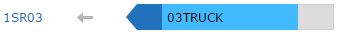

# Status bars - Staging

A status bar is used to represent the disposition of inventory or transport equipment as it relates to a staging lane, dock door, or yard location. Status bars also display the receiving and storage progress of an inbound shipment or the picking and loading progress of an outbound load. Regardless of whether the status bar relates to a staging lane or dock door, each status bar is color-coded to indicate either receiving or shipping activity.

When you click a status bar, a window is displayed that shows information related to the equipment, appointment, and inventory associated with the status bar. Depending on whether the status bar represents receiving or shipping activity, there are numerous tasks that can be performed from the status bar window. See [View status bar information](#View_status_bar_information).

If inventory in a staging lane or transport equipment at a dock door or in a yard location is moved to a different lane or door, the associated status bar is displayed for both locations on the dashboard until the move is complete. Additionally, you can view the pending to and from locations. For example, if equipment is checked in to DOOR2 and work is created in the queue to move it to DOOR4, the following text is similar to that which is displayed on the status bar for DOOR2: "Pending to DOOR4." The Move Pending tag is displayed under the status bar in location DOOR4; clicking the tag displays the from and to locations.

## Staging locations

If the status bar is associated with a staging lane, the following colors are used to show inventory progress:

   
| Received | Stored | Picked | Loaded |
| --- | --- | --- | --- |
|  |  |  |  |

As progress on the receiving or shipping work advances, the status bar is filled with more color, indicating the percentage of work that is complete. Additionally, a receiving status bar points toward the lane or door name, and a shipping status bar points away the lane or door.

The following images are examples of a receiving and shipping status bar:

These status bars indicate that the majority of the receiving and picking work is complete, but only a small percentage of the inventory in each lane is stored and loaded.

The identifier that is displayed on a receiving status bar is the inbound shipment being received, and in some cases the carrier identifier is also displayed. For shipping status bars, the associated transport equipment identifier and load number are displayed; however, if one or more shipments in a lane are not assigned to a load, the carrier identifier and transport equipment identifier are displayed instead.

## Door and yard locations

If you view status bars for door or yard locations, the following colors are used to indicate the type of equipment or activity that is associated with the locations:

  
| Receiving | Shipping | Storage |
| --- | --- | --- |
|  |  |  |

The receiving and shipping status bars related to dock doors are slightly different than those related to staging lanes in that they only indicate the activity and overall progress of the inbound shipment or outbound load. For example, the receiving color (blue) is not split into a light and dark contrast to illustrate receiving and storage progress. Instead, it is a single shade of blue to represent receiving activity, and the amount of the bar filled with color represents the percentage of inventory that has been received (but not necessarily stored).

Storage status bars for transport equipment are only associated with yard locations, and they do not indicate any sort of progress like the receiving and shipping status bars. The following image is an example of a storage status bar associated with transport equipment in a yard location:

If transport equipment is in a yard location but is not used for storage, then its status bar still indicates the type of equipment by the direction the bar is pointed, and it is colored gray until the equipment is checked in to a dock door or updated to become storage equipment.

## View status bar information

You can use this procedure to view and manage the status and progress related to inventory or equipment associated with a staging lane, dock door, and yard location.

1.  Perform one of the following tasks:
    -   View the Staging page.
        
        1.  Select one of the following modules: **Receiving** or **Shipping**.
            
        2.  Select **Staging**.
            
        
    -   View the Door Activity page.
        
        1.  Select one of the following modules: **Receiving**, **Shipping**, or **Yard**.
            
        2.  Select **Door Activity**.
            
        
2.  Under **Lanes**, **Doors**, or **Yard Locations**, select the status bar associated with the location and inventory or equipment for which you want to view details.
3.  View information in the [Status bar fields](#Status_bar_fields).
    
    **Note**: In addition to viewing information, you can perform multiple tasks from the status bar.
    
4.  To view the work associated with a status bar:
    
    1.  From the **Actions** drop-down list, select **Work Queue**.
    2.  To perform actions on the work queue, see [Manage the work queue](../work-queue/procedures-for-work-queue.md).

## Status bar fields

 
| Field | Description |
| --- | --- |
| Carrier | Identifier for a carrier that delivers inbound inventory to the warehouse or outbound shipments to a customer. This is the identifier that will be displayed to users on the application windows and reports. In the application, a carrier can be associated with a customer, order, inbound shipment, outbound shipment, load, and service levels (such as Ground, Next Day, and Saturday Delivery). |
| Transport Equipment | Alphanumeric identifier for transport equipment. Transport equipment numbers are not unique, can exist multiple times, and can be associated with various carriers. |
| Type | Transport equipment type assigned to the transport equipment. A transport equipment type identifies characteristics that are shared by individual pieces of transport equipment. For example, you can create a type for flatbed trailers, one 48 ft. rear load trailers, and another for equipment that has a liftgate. See [Transport Equipment Type](../../configuration/equipment/equipment/transport-equipment-type.md). |
| Appointment | Start and end time of the appointment associated with the transport equipment. |
| Checked In | Date on which the transport equipment was checked in. |
| Load | Unique identifier for a load. A load is one or more shipments grouped together into one or more stops that are shipped on a single piece of transport equipment. |
| Inbound Shipment | Unique identifier used for inventory tracking for an inbound shipment of inventory. An inbound shipment is a group of orders that are transported to the warehouse together or received together. When inventory arrives at the warehouse on a piece of transport equipment, an inbound shipment represents the contents of the transport equipment; however, one or more inbound shipments can be associated with a piece of transport equipment. |
| Time to End | Amount of time remaining in the scheduled appointment. |
| Past End | Amount of time that has passed since the end time of the scheduled appointment. |
| Started Unloading | Date/time on which an operator started to unload the inbound shipment. |
| Loaded | Date and time when the transport equipment was closed. |
| Received | Percentage of inventory that has been received against the expected quantity. Additionally, an X of Y value displays the number of eaches that are received out of the total number of expected eaches; for example, (50 of 100). |
| Picked | Percentage of inventory that has been picked. Additionally, an X of Y value displays the number of eaches that are picked out of the total number of expected eaches; for example, (50 of 100). The values for this field represent the amount of picked inventory for the displayed entity (order, shipment, stop, load, or wave). |
| Staged | Percentage of inventory that has been staged. Additionally, an X of Y value displays the number of eaches that are staged out of the total number of expected eaches; for example, (50 of 100). The values for this field represent the amount of staged inventory for the displayed entity (order, shipment, stop, load, or wave). |
| Loaded | Percentage of inventory that has been loaded. Additionally, an X of Y value displays the number of eaches that are loaded out of the total number of expected eaches; for example, (50 of 100). The values for this field represent the amount of loaded inventory for the displayed entity (order, shipment, stop, load, or wave). |

Supply Chain Execution Web Applications 2022.1.0.0 Help | Last updated: 31 May 2024

© 2014-2024 Blue Yonder Group, Inc. All rights reserved. [Legal notice](https://bf56-kms-wms-web-np2.jdadelivers.com/web/help/content/legal_notice.htm)

Contact: [Customer Support](https://success.blueyonder.com/ "Blue Yonder Customer Support") | [Services](https://blueyonder.com/services "Blue Yonder Services")
