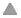

# Dashboard - Shipping

You use the Shipping Dashboard to monitor the current status of the staging lanes, doors, and appointments associated with outbound shipments, and any issues that may prevent inventory from being shipped. This information helps you make informed decisions to ensure the shipping dock is operating as efficiently as possible and that shipments are dispatched in a timely manner.

Specifically, the Dashboard displays the following information:

-   **Shipping issues**: Shipping issues are problems that prevent inventory from being allocated or shipped. The dashboard displays the load, item, or LPN quantities for each issue.
-   **Staging lanes**: The number of picks that cannot be released due to the lack of a staging lane and the number of staging lanes that are reserved for outbound inventory. The status bar displays the number of shipping staging lanes that are currently in use.
-   **Doors**: The number of loads for which a driver is waiting, the number of pieces of transport equipment that are ready for dispatch or that failed a safety check, and the average turn time for transport equipment. The status bar displays the number of shipping doors that are currently in use.
-   **Appointments**: The number of appointments that are waiting to be checked in, late to arrive, or late to depart. The progress bar displays the number of appointments that have departed out of the total number of scheduled outbound appointments for the current date.
-   **Progress**: The progress of planning, picking, and shipping activities for a specific date and time.
-   **Shipped today**: The actual and expected (where applicable) quantities of what has shipped from your warehouse on the current date and for a specific time frame.

## Monitor shipping issues

1.  Select **Shipping > Dashboard**.
2.  Under **Shipping Issues**, view the following information:
    
    **Note**: The Shipping Issues grid contains linked values that you can click to view information for the inventory associated with the issue. For example, you can click the number of unshippable loads and the Shipping Issues > Not Shippable Inventory page is displayed. See [Shipping issues](shipping-issues.md).
    
    -   **Short Loads and Items**: Number of loads for which one or more orders have not been completely fulfilled, and the number of items with unfulfilled demand.
    -   **Unshippable Inventory**: Number of loads that contain inventory that is either on a hold or has an inventory status (such as Expired or Damaged) that does not allow shipping.
    -   **Unassigned Staged Shipments**: Number of shipments that have been picked and staged but have not been assigned to an outbound load.
    -   **Problem Inventory**: Number of LPNs that have been picked, staged, and then moved to a problem location; for example because an order was cancelled or inventory was damaged during picking.

## Monitor staging lanes on the shipping dashboard

1.  Select **Shipping > Dashboard**.
2.  Under **Staging Lanes**, view the following information:
    
    **Note**: The Staging Lanes status bar shows the number of lanes currently in use. You can click the status bar to display the Staging dashboard. See [Staging](../shared-functions/staging.md).
    
    -   **Picks Held by Lack of Staging**: Number of picks that cannot be completed because there is no usable staging lane available to reserve for staging the picked inventory.
    -   **Reserved Lanes**: Number of staging lanes that have been allocated for picked inventory for a load. If a ship staging lane is also configured for receive staging and is allocated for incoming inventory, the lane is displayed as reserved.

## Monitor dock doors on the dashboard

1.  Select **Shipping > Dashboard**.
2.  Under **Doors**, perform one or more of the following tasks:
    
    **Note**: The Doors status bar shows the number of doors that are currently in use. You can click the status bar to display the Door Activity dashboard. See [Door Activity](../shared-functions/door-activity.md).
    
    -   To view the loads for which a driver is waiting, click **Live Loads**. The Live Loads window displays the transport equipment and the loading status for each load.
        
        **Note**: You can click the values in the window, such as for a load or transport equipment, to access additional information or tasks not included on the general dashboard. For example, if you click the load, the Door Activity dashboard is displayed with information relevant to that load.
        
    -   To view the transport equipment that is completely loaded and closed, click **Ready to Dispatch**.
    -   To view the transport equipment that has failed a safety check, click **Failed Safety Check**.
    -   Under **Average Turn Time**, view the average amount of time that a dock door is occupied from the time a safety check is performed on the transport equipment to the time it is dispatched. The application calculates this value by dividing the total usage time for all doors by the number of dock doors currently in use.

## Monitor appointments on the shipping dashboard

1.  Select **Shipping > Dashboard**.
2.  Under **Appointments**, perform one or more of the following tasks:
    
    **Note**: The Appointment status bar shows the number of completed appointments (dispatched transport equipment) out of the total number of outbound appointments scheduled for the day. You can click the status bar to link directly to the Door Activity dashboard. See [Door Activity](../shared-functions/door-activity.md).
    
    -   To view the appointments for which transport equipment has been checked into the yard but not yet moved to a dock door, click **Waiting**. The display shows the appointments that have started but the transport equipment is not at the door.
        
        **Note**: You can click the values in the window, such as for transport equipment, to access additional information or tasks not included on the general dashboard. For example, if you click the equipment identifier, the Door Activity page is displayed with information relevant to that equipment.
        
    -   To view the appointments that have ended but the transport equipment is still at the door, click **Late to Depart**. The display shows the appointments for which the transport equipment was not closed and dispatched by the end of its scheduled appointment time.
    -   To view appointments that have started but the transport equipment is not at the door, click **Late to Arrive**. The display shows the appointments for which the transport equipment has not arrived (has not been checked into the yard) by the start of its scheduled appointment time.

## Monitor shipping progress on the dashboard

You use the Shipping Dashboard to view information on the progress of planning, picking, and shipping activities for a specific date and time. You can use this information to make any adjustments necessary to ensure that the actual shipping output is trending positively toward the expected total output for the day.

1.  Select **Shipping > Dashboard**.
2.  Next to **Progress**, from the drop-down, select the level at which you want to view shipping progress.
3.  Use the calendar tool to select the date for which you want to view shipping progress. The **Progress** area displays the following information:
    -   **Bar chart**: Displays bars representing the progress of outbound inventory planning, picking, and shipping. Each bar contains color coding that represents the progress (in quantity) for each outbound activity and the amount of short inventory.
    -   **Pie chart**: Displays a color-coded chart that represents in greater detail the inventory planning, picking, and shipping progress (by percentage) for the time or bar you select. For example, if you select a bar from the bar chart that includes picking progress, the progress is represented in the pie chart by three separate phases: picking, post-picking, and staged.
        
        **Note**: The pie chart is only displayed if you select to view progress by a unit of measure (such as eaches, cases, or pallets).
        
    -   **Grid**: Displays information for the shipments or loads for the time or bar you select, including whether the associated inventory has been allocated and picked. The percentage of loading that is complete is also displayed.
        
        **Note**: The grid is only displayed if you select to view progress by shipment or load.
        
4.  To change the range of time that is displayed in the vertical timeline, next to the bar chart, click  or .
5.  To view the progress for a specific hour, click a time in the vertical timeline or click a progress bar in the bar chart. The pie chart or grid displays the information.
6.  To view additional information for the loads and shipments for which shipping progress is displayed, click a section of the pie chart or a row in the grid.
    
    **Note**: Clicking a section of the pie chart or a row in the grid directs you away from the general dashboard. For example, if you click a load in the grid, the Loads dashboard is displayed and filtered to the load you selected.
    

## View shipped inventory on the dashboard

You use the Shipping Dashboard to view what has been shipped from your warehouse on the current date and for the time frame you specify. You can use this information to make any adjustments necessary to ensure that the actual shipping output is trending positively toward the expected total output for the day.

1.  Select **Shipping > Dashboard**.
2.  Next to **Shipped Today**, use the time drop-down lists to specify the range for which you want to view shipped inventory.
3.  View the actual and, if applicable, expected values for the following categories:
    
    **Note**: To view categories that are not displayed, click  or  to scroll to the left or right.
    
    -   Loads
    -   Shorted shipment lines
    -   Shipments
    -   Shipment lines
    -   LPNs
    -   Parcel packages
    -   Customers

Supply Chain Execution Web Applications 2022.1.0.0 Help | Last updated: 31 May 2024

© 2014-2024 Blue Yonder Group, Inc. All rights reserved. [Legal notice](https://bf56-kms-wms-web-np2.jdadelivers.com/web/help/content/legal_notice.htm)

Contact: [Customer Support](https://success.blueyonder.com/ "Blue Yonder Customer Support") | [Services](https://blueyonder.com/services "Blue Yonder Services")
